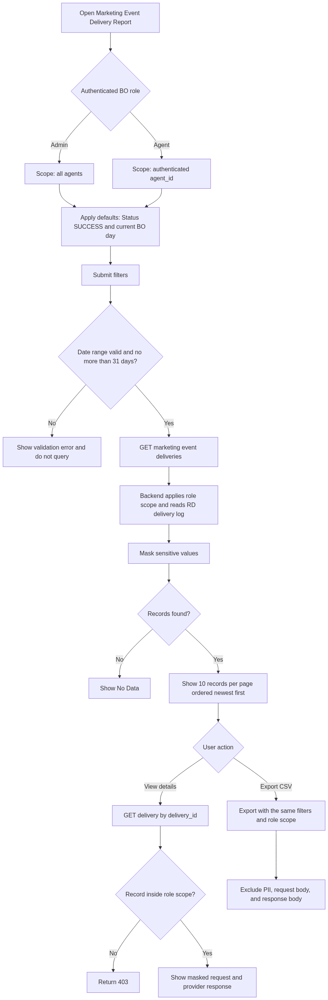

# Marketing Event Delivery Report PRD

| 項目 | 內容 |
|---|---|
| 平台 | Agent BO、Admin BO |
| 版本 | 1.0 |
| 日期 | 2026-07-14 |
| Mockup | [GitHub Pages](https://guswei.github.io/betally-bo-mockup/marketing-event-delivery-report/mockup.html)；本地 Agent route：`/marketing-event-delivery-report`；本地 Admin route：`/admin/marketing-event-delivery-report` |
| RD Spec | [GitHub](https://github.com/guswei/betally-bo-mockup/blob/main/marketing-event-delivery-report/marketing_event_delivery_report_spec.md) |
| 流程圖原始檔 | [GitHub](https://github.com/guswei/betally-bo-mockup/blob/main/marketing-event-delivery-report/marketing_event_delivery_report_PRD_flow.md) |

## 1. 需求背景

Meta Conversion API、Adjust API 與 CleverTap API 的事件由後端送出後，BO 使用者目前沒有同一個入口可查發送結果。新報表讀取 RD event delivery log，顯示每次 delivery attempt 的成功或失敗狀態。查詢結果預設只列 `SUCCESS`，使用者切換 Status 後才能看到 `FAILED`。

本報表不在查詢時呼叫第三方，也不重新判斷 provider response。狀態、事件名稱與可用欄位以 RD event delivery log 為資料來源。

## 2. 核心功能變更

### FR-1：統一查詢事件發送紀錄

Agent BO 與 Admin BO 新增 `Marketing Event Delivery Report`。頁面合併顯示 `META`、`ADJUST`、`CLEVERTAP` 的 delivery attempt，依 `sent_at` 由新到舊排列。每次 retry 保留獨立紀錄，不覆蓋先前結果。

### FR-2：提供報表篩選與預設條件

頁面提供 `Prefix`（Admin only）、`Username`、`Provider`、`Event`、`Status`、`Start Time – End Time`。`Status` 預設 `SUCCESS`，日期預設為 BO 當日 00:00:00–23:59:59。單次日期範圍不得超過 31 天，預設每頁 10 筆。

### FR-3：依登入身分限制資料範圍

Admin 可查所有 Agent，並可用 `Prefix` 篩選。Agent 只能查登入者所屬 `agent_id` 的紀錄。Agent request 不接受自訂 Prefix 作為資料範圍依據，後端必須從登入資訊套用 ownership。

### FR-4：顯示列表與遮罩後明細

列表顯示 `Sent Date`、`Prefix`、`Username`、`Provider`、`User Behavior`、`Provider Event`、`Status`、`Amount`、`Transaction ID`、`Details`。不顯示 `Currency`；未適用值顯示 `—`。Details 顯示 delivery ID、attempt、request／response 時間、HTTP status、error code、error message、遮罩後 request properties 與 provider response。

### FR-5：套用已確認的事件範圍

Meta 顯示 `Deposit → AddToCart` 與 `First Deposit → Purchase`。Adjust 只顯示 `Deposit`。CleverTap 只顯示後端觸發的 `Sign Up`、`Deposit Initiated`、`Deposit Completed`、`Withdrawal Initiated`、`Withdrawal Completed`、`VIP Upgrade`、`Bet Placed`。

### FR-6：匯出目前查詢結果

`Export CSV` 使用與畫面相同的篩選條件及登入身分資料範圍。CSV 不輸出 PII、request body 或 response body。

## 3. 介面設計

### 3.1 頁面與狀態

Mockup 沿用現有 BO 報表的灰底、白色查詢卡、綠色 Search 按鈕、淺綠表頭與 `Export CSV`。Agent route 顯示登入 Agent 的資料；Admin route 多一個 Prefix 篩選，可查看不同 Agent。

| UI state | 行為 |
|---|---|
| Default | `Status = Success`、日期為 BO 當日、每頁 10 筆。 |
| Loading | 查詢區保留目前輸入，列表顯示 `Loading...`，避免重複送出查詢。 |
| Empty | 表頭保留，內容顯示 `No Data`。 |
| Error | 顯示 `Failed to load event delivery records. Please try again.`，不沿用前一次資料冒充本次結果。 |
| Invalid date | 顯示日期錯誤，不呼叫 list API。 |
| Permission denied | Detail API 回傳 403 時不顯示資料，頁面顯示無權存取訊息。 |
| Details | Modal 顯示遮罩後欄位；按 `Close`、右上角 X 或點 modal 外部關閉。 |

### 3.2 篩選欄位

| 欄位 | Agent | Admin | 規則 |
|---|---|---|---|
| `Prefix` | 不顯示 | 顯示 | 預設 `All`；選項來自 Admin 可見 Agent。 |
| `Username` | 顯示 | 顯示 | 可空白；字串包含查詢。 |
| `Provider` | 顯示 | 顯示 | `All`、`Meta`、`Adjust`、`CleverTap`。 |
| `Event` | 顯示 | 顯示 | 依 Provider 顯示可用事件；Provider 為 All 時可選 All。 |
| `Status` | 顯示 | 顯示 | `Success`、`Failed`、`All`；預設 `Success`。 |
| `Start Time – End Time` | 顯示 | 顯示 | 必填；結束時間不得早於開始時間，區間不得超過 31 天。 |

### 3.3 BO 欄位表

| 欄位 | 格式 | 空值行為 | 說明 |
|---|---|---|---|
| `Sent Date` | `DD/MM/YYYY HH:mm:ss` | 不可空 | RD log 的發送時間。 |
| `Prefix` | String | 不可空 | 紀錄所屬 Agent Prefix。 |
| `Username` | String | `—` | 玩家帳號。 |
| `Provider` | Enum | 不可空 | `META`、`ADJUST`、`CLEVERTAP`。 |
| `User Behavior` | String | 不可空 | 我方業務事件名稱。 |
| `Provider Event` | String | `—` | Provider event name；Adjust 無獨立名稱時可顯示 `Deposit`。 |
| `Status` | Enum | 不可空 | `SUCCESS`、`FAILED`，直接讀 RD log。 |
| `Amount` | `DECIMAL(18,2)` | `—` | API 使用 decimal string，畫面不顯示 Currency。 |
| `Transaction ID` | String | `—` | 業務交易編號。 |
| `Details` | Action | 不適用 | 開啟唯讀明細。 |

## 4. 資料模型

本需求不新增或修改 sender 的 DB schema。後端以既有 RD event delivery log 建立唯讀 projection，至少輸出 `delivery_id`、`attempt_no`、`agent_id`、`prefix`、`username`、`provider`、`user_behavior`、`provider_event`、`status`、`amount`、`transaction_id`、`sent_at`、request／response 時間、HTTP status 與錯誤資訊。

`Amount` 的資料庫精度維持 `DECIMAL(18,2)`，禁止 float。每次 retry 必須有不同 `delivery_id` 或相同業務 event 下遞增的 `attempt_no`，舊紀錄不得被更新成新結果。紀錄保留 180 天；到期後不再出現在查詢或 CSV。

若既有 log 另存 request／response body，report adapter 必須先遮罩再回傳。不得把 access token、authorization、secret、password、phone、WhatsApp 或 Telegram 明文送到前端或寫入 CSV。

## 5. 流程圖

可編輯 Mermaid source：[GitHub](https://github.com/guswei/betally-bo-mockup/blob/main/marketing-event-delivery-report/marketing_event_delivery_report_PRD_flow.md)。

## 6. 選單位置

| BO | 選單路徑 | Route | 資料範圍 |
|---|---|---|---|
| Agent BO | `Report Management` → `Marketing Event Delivery Report` | `/marketing-event-delivery-report` | 登入者所屬 Agent。 |
| Admin BO | `System Report` → `Marketing Event Delivery Report` | `/admin/marketing-event-delivery-report` | 所有 Agent，可用 Prefix 篩選。 |

本期不拆四層級權限，不新增 View／Export 權限位。頁面可見性沿用 Admin 與 Agent 的既有 BO 身分；後端仍須執行 ownership，不得只靠側邊欄或前端隱藏欄位。

## 7. 驗收標準

- `AC-1`（對應 `FR-1`、`FR-2`）：使用者首次進入頁面時，Status 為 `Success`，日期為 BO 當日 00:00:00–23:59:59，列表只顯示 `SUCCESS`。
- `AC-2`（對應 `FR-2`）：使用者把 Status 改為 `Failed` 並搜尋後，列表只顯示 `FAILED`；改為 `All` 時可同時顯示兩種狀態。
- `AC-3`（對應 `FR-5`）：Meta 紀錄只使用 `Deposit → AddToCart` 與 `First Deposit → Purchase` mapping。
- `AC-4`（對應 `FR-5`）：Adjust 只顯示 `Deposit`；Registration 與 First Deposit 不納入本報表事件範圍。
- `AC-5`（對應 `FR-5`）：CleverTap 只顯示 7 個 Backend events；`Login` 與 4 個 Visit Page events 不出現在報表。
- `AC-6`（對應 `FR-3`）：Admin 未選 Prefix 時可看到不同 Prefix 的紀錄；選定 Prefix 後只顯示該 Prefix。
- `AC-7`（對應 `FR-3`）：Agent 查詢 list、detail、export 時，後端只回傳登入者所屬 `agent_id`；即使 request 加入其他 Prefix 也不得跨 Agent 讀取。
- `AC-8`（對應 `FR-4`）：列表包含 Prefix、Amount 與 Transaction ID，不包含 Currency；無值欄位顯示 `—`。
- `AC-9`（對應 `FR-4`）：Details 顯示 delivery attempt 與 provider 結果；access token、authorization、secret、password、phone、WhatsApp、Telegram 不得明文出現。
- `AC-10`（對應 `FR-1`）：同一業務事件 retry 後，列表保留每次 attempt，先前 `FAILED` 不得被後續 `SUCCESS` 覆蓋。
- `AC-11`（對應 `FR-2`）：開始時間晚於結束時間或區間超過 31 天時，前端顯示錯誤且不送出查詢；後端收到相同無效參數時回傳 400。
- `AC-12`（對應 `FR-2`）：查詢預設每頁 10 筆，依 `sent_at` 新到舊排列；切換既有 BO 分頁設定後回傳對應頁面。
- `AC-13`（對應 `FR-6`）：CSV 套用畫面上的篩選與 ownership，且不含 PII、request body、response body 或 Currency。
- `AC-14`（對應 `FR-1`、`FR-4`）：API 回傳空陣列、讀取中或查詢失敗時，頁面分別顯示 `No Data`、`Loading...` 或錯誤訊息，不顯示前一次結果。
- `AC-15`（對應 `FR-1`、`FR-6`）：超過 180 天的紀錄不出現在 list、detail 或 CSV；detail 查詢已到期紀錄時回傳 404。

### FR／AC 追蹤表

| FR | AC |
|---|---|
| `FR-1` | `AC-1`、`AC-10`、`AC-14`、`AC-15` |
| `FR-2` | `AC-1`、`AC-2`、`AC-11`、`AC-12` |
| `FR-3` | `AC-6`、`AC-7` |
| `FR-4` | `AC-8`、`AC-9`、`AC-14` |
| `FR-5` | `AC-3`、`AC-4`、`AC-5` |
| `FR-6` | `AC-13`、`AC-15` |

## 8. 非功能需求（NFR）

- `NFR-SEC`：list、detail、export 都要在後端依登入身分套用 ownership。所有敏感值先遮罩再離開後端；log、API response 與 CSV 都不得包含憑證或明文 PII。
- `NFR-REL`：報表只讀，不得因查詢或匯出觸發 provider API。讀取失敗時回傳明確錯誤，不得用快取舊資料冒充本次查詢結果。
- `NFR-DATA`：Amount 使用 `DECIMAL(18,2)`，API 回傳 decimal string。時間由後端以 UTC 儲存，依 BO timezone 顯示為 `DD/MM/YYYY HH:mm:ss`。每個 attempt 皆保留，資料保留 180 天。

## 9. 假設與限制（ASM / CST）

- `ASM-1`：既有 RD event delivery log 已能提供列表所需欄位；report adapter 只做欄位 projection 與遮罩，不改 sender payload。
- `ASM-2`：`agent_id` 與 Prefix 有唯一且可查詢的現行 mapping，登入資訊可取得 `agent_id`。
- `ASM-3`：每頁筆數選項沿用 BO 既有分頁元件；本需求只固定預設值為 10。
- `CST-1`：本報表唯讀，不提供 retry、補送、刪除或修改紀錄。
- `CST-2`：本期不修改 Meta、Adjust、CleverTap 的憑證、事件 mapping 或觸發條件。
- `CST-3`：CleverTap 前端 SDK 觸發的 `Login` 與 Visit Page events 不在本期範圍。
- `CST-4`：列表與 CSV 不顯示 Currency；本期不拆四層級權限或新增獨立權限位。
