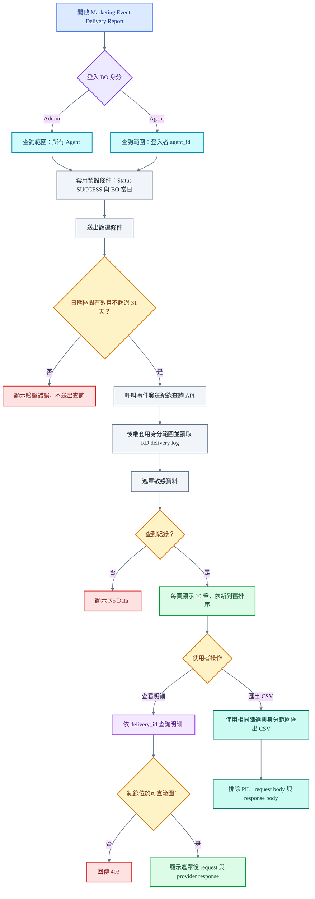

# Marketing Event Delivery Report — Flow Diagrams

## Flow 01：查詢、權限與輸出

```mermaid
%%{init: {"theme": "base", "themeVariables": {"background": "#ffffff", "fontFamily": "Arial, Noto Sans TC, sans-serif", "lineColor": "#64748b", "primaryTextColor": "#1f2937"}}}%%
flowchart TD
    A["開啟 Marketing Event Delivery Report"] --> B{"登入 BO 身分"}
    B -->|Admin| C["查詢範圍：所有 Agent"]
    B -->|Agent| D["查詢範圍：登入者 agent_id"]
    C --> E["套用預設條件：Status SUCCESS 與 BO 當日"]
    D --> E
    E --> F["送出篩選條件"]
    F --> G{"日期區間有效且不超過 31 天？"}
    G -->|否| H["顯示驗證錯誤，不送出查詢"]
    G -->|是| I["呼叫事件發送紀錄查詢 API"]
    I --> J["後端套用身分範圍並讀取 RD delivery log"]
    J --> K["遮罩敏感資料"]
    K --> L{"查到紀錄？"}
    L -->|否| M["顯示 No Data"]
    L -->|是| N["每頁顯示 10 筆，依新到舊排序"]
    N --> O{"使用者操作"}
    O -->|查看明細| P["依 delivery_id 查詢明細"]
    P --> Q{"紀錄位於可查範圍？"}
    Q -->|否| R["回傳 403"]
    Q -->|是| S["顯示遮罩後 request 與 provider response"]
    O -->|匯出 CSV| T["使用相同篩選與身分範圍匯出 CSV"]
    T --> U["排除 PII、request body 與 response body"]

    classDef start fill:#dbeafe,stroke:#2563eb,stroke-width:2px,color:#1e3a8a;
    classDef identity fill:#ede9fe,stroke:#7c3aed,stroke-width:2px,color:#4c1d95;
    classDef scope fill:#cffafe,stroke:#0891b2,stroke-width:2px,color:#164e63;
    classDef action fill:#f1f5f9,stroke:#64748b,stroke-width:1.5px,color:#1f2937;
    classDef decision fill:#fef3c7,stroke:#d97706,stroke-width:2px,color:#78350f;
    classDef success fill:#dcfce7,stroke:#16a34a,stroke-width:2px,color:#14532d;
    classDef error fill:#fee2e2,stroke:#dc2626,stroke-width:2px,color:#7f1d1d;
    classDef detail fill:#f3e8ff,stroke:#9333ea,stroke-width:2px,color:#581c87;
    classDef export fill:#ccfbf1,stroke:#0f766e,stroke-width:2px,color:#134e4a;

    class A start;
    class B identity;
    class C,D scope;
    class E,F,I,J,K action;
    class G,L,O,Q decision;
    class N,S success;
    class H,M,R error;
    class P detail;
    class T,U export;
    linkStyle default stroke:#64748b,stroke-width:1.5px;
```
