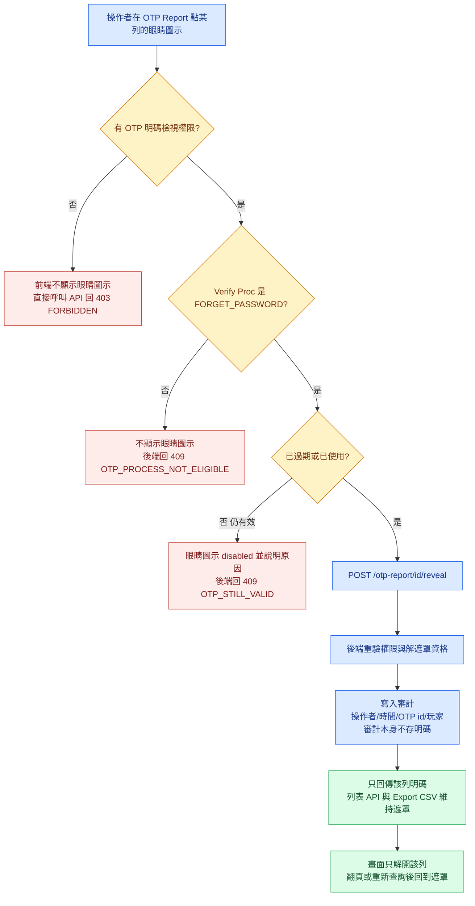

# PRD：OTP Verify Code 解遮罩

**版本**：v1.0（2026-09-22）　**類型**：功能變更　**負責**：PM
**Mockup**：https://guswei.github.io/betally-bo-mockup/otp-unmask/mockup.html
**相關**：[RD Spec](https://github.com/guswei/betally-bo-mockup/blob/main/otp-unmask/otp_unmask_spec.md)

## 1. 需求背景

`OTP Report` 的 `Verify Code` 欄目前一律顯示 `XXXXXX`。客服處理忘記密碼的申訴時，看不到系統實際發出的驗證碼，無法判斷碼是否正確送出。客戶要求開放檢視，並與權限設定連動。

客戶原文提到「Email & Phone Verification OTP Code」，指的是 email 驗證與手機驗證所使用的驗證碼。`Mobile or Email` 欄現況即為明文，不在本次範圍。

本案只改 `Verify Code` 一欄的顯示行為，並限制在忘記密碼流程且已失效的驗證碼。不改動 OTP 的產生、發送與驗證流程。

## 2. 核心功能變更

| # | 變更 (FR) | 說明 |
|---|---|---|
| FR-1 | `Verify Code` 逐列解遮罩 | 儲存格內新增眼睛圖示，點擊後只解開該列。再次點擊回到遮罩；查詢、重設或換頁後一律回到遮罩 |
| FR-2 | 解遮罩資格限制 | 僅 `Verify Proc` 為 `FORGET_PASSWORD` 且已失效（已過期或 `verify_time` 有值）的驗證碼可解遮罩 |
| FR-3 | 新增權限節點 | 新增獨立的 OTP 明碼檢視權限，掛於 `Role Setting`，不綁定 4-tier 層級 |
| FR-4 | 解遮罩審計 | 每次成功解遮罩寫入一筆紀錄，含操作者、時間、OTP 記錄 `id`、玩家 `username` |
| FR-5 | `Export CSV` 維持遮罩 | CSV 的 `Verify Code` 一律輸出 `XXXXXX`，不因權限而改變 |

範圍：`OTP Report` 的 `Verify Code` 欄、`Role Setting` 的權限節點、解遮罩 API 與審計。OUT：`Mobile or Email` 欄、OTP 產生／發送／驗證流程與有效期長度、`FORGET_PASSWORD` 以外的 `Verify Proc`、既有篩選與分頁、批次解遮罩、解遮罩紀錄的查詢頁面。

## 3. 介面設計

以 Mockup 為準：https://guswei.github.io/betally-bo-mockup/otp-unmask/mockup.html

- `Verify Code` 儲存格內新增眼睛圖示，依資格呈現三種狀態：可點擊、`disabled` 並附英文說明、完全不顯示。
- 權限不足時圖示隱藏，不使用 `disabled`。因業務規則而不可操作（驗證碼仍有效）採 `disabled` 並說明原因與可以做什麼。
- 遮罩態一律顯示六個 `X`，不反映實際碼長。
- 既有欄位順序、篩選區、分頁與 `Columns Settings` 不變。

**BO 欄位表**：

| 欄位 | 型別/精度 | 必填 | 說明 / enum / 邊界 |
|---|---|---|---|
| `Verify Code`（遮罩態） | 顯示字串 | 是 | 固定六個 `X`，不反映實際碼長 |
| `Verify Code`（明碼態） | 顯示字串 | 否 | 僅由 reveal API 取得。列表 API 與 CSV 不得包含此值 |
| `Expiry` | `DATETIME` | 是 | 既有欄位。與目前時間比較判定是否已過期，時區 `GMT+07:00` |
| `verify_time` | `DATETIME` | 否 | 既有欄位。有值代表已完成驗證，該碼視為已使用 |
| `Verify Proc` | enum | 是 | 既有欄位。僅 `FORGET_PASSWORD` 適用本次功能 |

## 4. 資料模型

本案不新增業務欄位，解遮罩的資格判定全部使用既有欄位。新增的是權限節點與審計紀錄。

| Table | 欄位 | 型別 | 約束 |
|---|---|---|---|
| 既有權限節點資料表 | OTP 明碼檢視權限節點 | 沿用既有權限節點型別 | 由 `Role Setting` 指派，不綁定 4-tier 層級 |
| 解遮罩審計紀錄 | 操作者 | 沿用既有操作者識別型別 | `NOT NULL` |
| 解遮罩審計紀錄 | 解遮罩時間 | `DATETIME` | `NOT NULL`，時區 `GMT+07:00` |
| 解遮罩審計紀錄 | OTP 記錄 `id` | 沿用 OTP 記錄的識別型別 | `NOT NULL` |
| 解遮罩審計紀錄 | 玩家 `username` | 沿用既有玩家識別型別 | `NOT NULL` |

審計紀錄不得包含驗證碼明碼欄位。同一 OTP 記錄可對應多筆審計紀錄，不建立去重約束。

## 5. 流程圖

解遮罩的三道資格檢查，以及通過後的後端處理順序。

## 6. 選單位置

沿用現有，無新增選單項。本案在既有 `OTP Report` 頁面內變更 `Verify Code` 欄的行為。

| 選單路徑 | 角色 / 權限 | 說明 |
|---|---|---|
| `OTP Report` | 沿用既有頁面檢視權限 | 誰能進入此頁面不變更 |
| `OTP Report` → `Verify Code` 解遮罩 | 新增的 OTP 明碼檢視權限節點 | **不綁定 4-tier 層級**。被授予者即可執行，與其在 Admin / Brand Admin / Agent Admin / Sub Agent Admin 的哪一層無關 |
| `Role Setting` | 沿用既有權限設定的授權 | 新權限節點在此指派 |

## 7. 驗收標準（AC）

| AC-ID | 對應 FR | 驗收條件 |
|---|---|---|
| AC-01 | FR-1 | 有權限的操作者對一筆已過期的 `FORGET_PASSWORD` 記錄點擊眼睛圖示，該列 `Verify Code` 顯示明碼，同頁其他列維持 `XXXXXX`。 |
| AC-02 | FR-1 | 承 AC-01，再次點擊同一圖示回到 `XXXXXX`；執行查詢、重設篩選或換頁後，已解開的欄位一律回到 `XXXXXX`。 |
| AC-03 | FR-2 | `verify_time` 有值的 `FORGET_PASSWORD` 記錄，即使未達 `Expiry`，眼睛圖示可點擊且能取得明碼。 |
| AC-04（負向） | FR-2 | 未達 `Expiry` 且 `verify_time` 為空的記錄，眼睛圖示為 `disabled`；直接呼叫 reveal API 回 `409` 且錯誤鍵為 `OTP_STILL_VALID`，回應**不得**包含明碼。 |
| AC-05（負向） | FR-2 | `Verify Proc` 不是 `FORGET_PASSWORD` 的列**不得**出現眼睛圖示；直接呼叫 reveal API 回 `409` 且錯誤鍵為 `OTP_PROCESS_NOT_ELIGIBLE`，回應**不得**包含明碼。 |
| AC-06（負向） | FR-3 | 未被授予 OTP 明碼檢視權限的操作者，清單**不得**出現眼睛圖示；直接呼叫 reveal API 回 `403` 且回應**不得**包含明碼。此判定與該操作者的 4-tier 層級無關。 |
| AC-07（負向） | FR-1 | `OTP Report` 列表 API 的回應**不得**包含 `Verify Code` 明碼，操作者持有解遮罩權限時亦同。 |
| AC-08 | FR-4 | 每次成功解遮罩產生一筆審計紀錄，內容包含操作者、時間、OTP 記錄 `id` 與玩家 `username`。 |
| AC-09（負向） | FR-4 | 審計紀錄**不得**儲存驗證碼明碼。 |
| AC-10 | FR-4 | 同一列連續解遮罩兩次產生兩筆審計紀錄；再次點擊回到遮罩態不產生紀錄。 |
| AC-11（負向） | FR-4 | 被 `403` 或 `409` 拒絕的 reveal 請求**不得**產生成功的解遮罩審計紀錄。 |
| AC-12（負向） | FR-5 | `Export CSV` 輸出的 `Verify Code` 一律為 `XXXXXX`；持有解遮罩權限的操作者匯出時亦同。 |
| AC-13 | FR-3 | 新權限節點可在 `Role Setting` 指派給角色，指派後該角色的操作者即可見眼睛圖示。 |

## 8. 非功能需求（NFR）

| NFR-ID | 類別 | 需求 |
|---|---|---|
| NFR-REL | 可靠性 | 既有的篩選、分頁、`Columns Settings` 與 `Export CSV` 其他欄位的行為不得改變。OTP 的產生、發送、驗證流程與有效期長度不得受影響。 |
| NFR-DATA | 金額/資料精度 | 本案不新增金額欄位，既有金額欄位的 `DECIMAL(18,2)` 精度不受本案影響。遮罩字串固定為六個 `X`，不因實際碼長變動；時間欄位一律以 `GMT+07:00` 判讀。 |
| NFR-SEC | 安全 | 驗證碼明碼只經由 reveal API 回傳單筆，列表 API、`Export CSV` 與審計紀錄皆不得包含明碼。後端一律重新驗證權限與解遮罩資格，不接受前端送來的資格判定。 |

## 9. 假設與限制（ASM / CST）

| ID | 內容 |
|---|---|
| ASM-1 | `verify_code` 在資料庫中的儲存形式需 RD 確認。若為不可還原的雜湊，本案無法依現狀實作，需先確認是否改為可還原的儲存方式；該變更會降低 OTP 的儲存安全性，屬需另行拍板的決定。 |
| ASM-2 | `OTP Report` 的實際選單路徑需 RD 確認。本 workspace 的 sidebar 只有 `SMS OTP`，與本頁面是否為同一項未確認。 |
| ASM-3 | 解遮罩審計的落點需 RD 確認是沿用既有操作紀錄機制或另建。 |
| ASM-4 | OTP 有效期長度需 RD 確認。客戶提供的畫面中兩筆記錄的 `Created Date` 與 `Expiry` 相差皆為 2 分鐘。此值影響「只開放已失效的碼」對客服實際作業的影響範圍。 |
| ASM-5 | `Expiry` 與 `verify_time` 實際儲存與回傳的時區基準需 RD 確認。已知證據為系統狀態列顯示 `GMT+07:00`（使用者 2026-09-22 提供的 BO 截圖），但 `OTP Report` 清單上的時間欄位未標時區，無法確認其基準與狀態列相同。此項直接影響過期判定的正確性。 |
| CST-1 | 列表 API 的回應不得包含明碼，不論操作者是否有權限。只做畫面遮罩時，開發者工具即可取得明碼。 |
| CST-2 | `Export CSV` 的 `Verify Code` 維持 `XXXXXX`。 |
| CST-3 | 不改動 OTP 的產生、發送、驗證流程與有效期長度。 |
| CST-4 | `Mobile or Email` 欄維持現狀，本案不處理該欄的遮罩與否。 |
