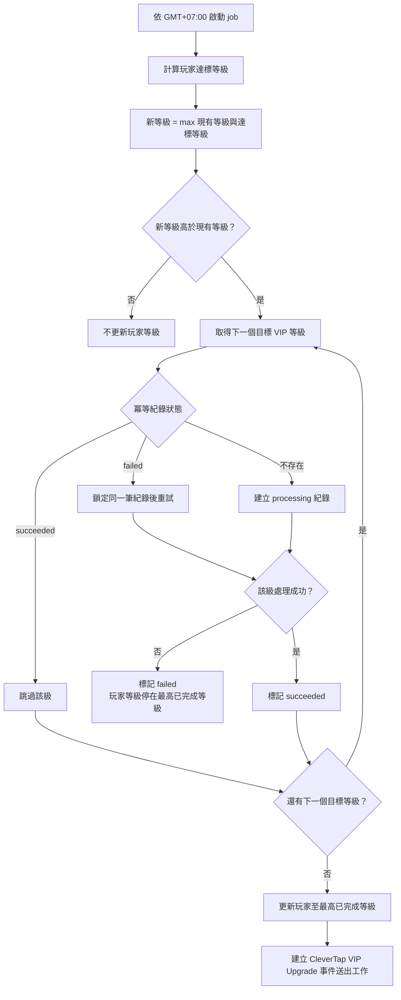

# PRD：VIP 等級升級改為每小時檢查

**版本**：v1.0（2026-08-13）　**類型**：功能變更　**負責**：PM / RD  
**Mockup**：N/A —— 本需求沿用既有頁面，只在既有 `System Config` → `VIP` tab 增加一個設定欄位  
**相關**：`_workspace/vip_hourly_upgrade_spec.md`

## 1. 需求背景

Agent BO 目前每天處理一次 VIP 等級升級，玩家達標後要等到隔日才會更新。本次把檢查週期改為可設定，預設每 `60` 分鐘執行一次，讓達標玩家在下一次 job 執行時升級。VIP 達標條件、手動調整 VIP、`Payment Level` 與 `Allow VIP Bonus` 的既有行為不變。

## 2. 核心功能變更

| # | 變更 (FR) | 說明 |
|---|---|---|
| FR-1 | VIP 升級 job 執行間隔 | job 依 `System Config` → `VIP` tab 的執行間隔運作。設定值型別為 `INT`、單位為分鐘、預設 `60`、下限 `60`，時間計算使用 `GMT+07:00`。設定值可在大於或等於 `60` 的整數間調整。 |
| FR-2 | 只升不降 | 每次 job 以 `新等級 = max(現有等級, 達標等級)` 計算結果。只有達標等級高於現有等級時才更新，不得自動降級，也不得覆蓋 BO 已手動調高的等級。 |
| FR-3 | 逐級發放升等獎金 | 玩家跨越多個 VIP 等級時，每經過一級發一筆該級獎金。`VIP0 → VIP3` 發放 VIP1、VIP2、VIP3 共三筆；總發放金額不得因 job 執行頻率改變。現行邏輯差異與額外工作量見 ASM-1。 |
| FR-4 | 升級與獎金冪等 | 冪等鍵使用「玩家 + 目標 VIP 等級」。同一玩家的同一目標等級只允許一筆成功結果；失敗結果須沿用同一冪等紀錄重試。job 重跑或併發執行不得重複升級、發放獎金或建立同一筆升級事件送出工作。 |
| FR-5 | 執行間隔設定權限 | 只有 Admin / Brand Admin 可維護執行間隔。前端與後端都要拒絕小於 `60` 的值及未授權的修改，並沿用既有 System Config 稽核機制記錄變更前後值與操作者。 |
| FR-6 | CleverTap 升級事件 | 每次 job 將玩家等級更新至本次已完成的最高等級後，沿用既有 CleverTap `VIP Upgrade` 事件送出一筆事件；跨多級不逐級送事件。properties 為 `Previous Level (String)` 與 `New Level (String)`。沒有等級異動時不得建立事件送出工作。 |

範圍：VIP 升級排程、逐級獎金、升級事件，以及 `System Config` → `VIP` tab 的執行間隔設定。OUT：VIP 達標條件、VIP 降級、`Payment Level`、`Allow VIP Bonus`、手動調整 VIP 的既有行為、其他 System Config 設定與 mockup 程式。

## 3. 介面設計

沿用既有 `System Config` → `VIP` tab，不新增頁面。新增執行間隔欄位；未授權角色不可操作。`2.1 Player List` → `Player's Info` 右側 VIP 區塊不改版。

**BO 欄位表**：

| 欄位 | 型別/精度 | 必填 | 說明 / enum / 邊界 |
|---|---|---|---|
| VIP upgrade interval (minutes) | `INT` | 是 | 預設 `60`，下限 `60`。前端與後端都要阻擋小於 `60` 的值；只允許 Admin / Brand Admin 修改。 |

## 4. 資料模型

沿用既有 System Config 儲存機制，不新增獨立 table。執行間隔以 `INT` 儲存，預設 `60`，並在資料層或既有設定驗證層限制值不得小於 `60`。升等獎金沿用各 VIP 等級既有金額設定與 `DECIMAL(18,2)` 精度，不得使用 float。升級與獎金處理需持久化「玩家 + 目標 VIP 等級」業務鍵，並以唯一約束阻擋重複處理。

| Table | 欄位 | 型別 | 約束 |
|---|---|---|---|
| 既有 System Config 儲存體 | VIP upgrade interval | `INT` | `NOT NULL`、default `60`、值不得小於 `60` |
| 既有 VIP 升級／獎金處理紀錄儲存體 | 玩家 + 目標 VIP 等級 | 既有型別 | 業務唯一約束；同一玩家、同一目標等級只允許一筆紀錄，狀態至少區分 `processing`、`succeeded`、`failed` |

## 5. 流程圖

job 讀取執行間隔後，依 `GMT+07:00` 啟動檢查；逐一計算玩家達標等級，只處理高於現有等級的結果。跨級時依序處理每個目標等級；冪等紀錄為 `succeeded` 時跳過該級，為 `failed` 時鎖定同一筆紀錄重試。完成後更新玩家等級並建立既有 CleverTap `VIP Upgrade` 事件送出工作。

## 6. 選單位置

沿用 `System Config` → `VIP` tab，不新增選單項目。Admin / Brand Admin 可檢視與修改執行間隔；其他角色不得修改。

| 選單路徑 | 角色 / 權限 | 說明 |
|---|---|---|
| `System Config` → `VIP` | Admin / Brand Admin | 可檢視並修改 VIP upgrade interval |
| `System Config` → `VIP` | 非 Admin / Brand Admin | 不可修改 VIP upgrade interval；後端仍須拒絕直接送出的修改請求 |

## 7. 驗收標準（AC）

| AC-ID | 對應 FR | 驗收條件 |
|---|---|---|
| AC-01 | FR-1 | 執行間隔未修改時，job 以 `60` 分鐘為週期，並以 `GMT+07:00` 計算執行時間。 |
| AC-02 | FR-1, FR-5 | Admin / Brand Admin 將間隔改為大於 `60` 的整數分鐘，或從較大值改回 `60` 後，後續 job 使用新週期。 |
| AC-03（負向） | FR-1, FR-5 | 操作者輸入小於 `60` 或非整數值時，前端不得送出；直接呼叫後端時也不得保存，原設定值維持不變。 |
| AC-04（負向） | FR-5 | 非 Admin / Brand Admin 嘗試修改間隔時，介面不得提供可操作控制項；直接呼叫後端時也不得保存，且原設定值維持不變。 |
| AC-05 | FR-2 | 玩家達標等級高於現有等級時，job 把玩家 VIP 更新為達標等級。 |
| AC-06（負向） | FR-2 | 玩家達標等級等於或低於現有等級時，job 不修改玩家 VIP，BO 手動調高的等級不會被下調。 |
| AC-07 | FR-3 | 符合既有獎金發放條件的玩家由 `VIP0` 升到 `VIP3` 時，系統各發一筆 VIP1、VIP2、VIP3 的既有獎金，金額精度為 `DECIMAL(18,2)`。 |
| AC-08（負向） | FR-3, FR-4 | 相同玩家與相同目標 VIP 等級已成功處理時，job 重跑或併發執行不得再次發放該級獎金。 |
| AC-09 | FR-4 | 玩家跨越多級時，每個目標 VIP 等級各建立一次可追溯的處理結果；完成後玩家等級為本次已完成逐級處理的最高等級。 |
| AC-10（負向） | FR-4 | 同一玩家同一目標 VIP 等級出現重複或併發請求時，唯一約束只允許一筆紀錄及一筆成功結果；既有結果為失敗時，後續 job 更新同一筆紀錄重試，不新增第二筆。 |
| AC-11 | FR-5 | Admin / Brand Admin 成功修改間隔後，稽核紀錄可查到操作者、修改時間、修改前值與修改後值。 |
| AC-12 | FR-6 | 玩家在單次 job 由 `VIP0` 實際更新至 `VIP3` 後，系統建立一筆 CleverTap `VIP Upgrade` 事件送出工作，`Previous Level (String)` 為 `VIP0`，`New Level (String)` 為 `VIP3`；不得另建 VIP1、VIP2 事件。 |
| AC-13（負向） | FR-4, FR-6 | 玩家等級未異動或相同升級事件送出工作已存在時，不得建立第二筆 CleverTap `VIP Upgrade` 事件送出工作。外部發送失敗沿用既有 CleverTap 重試機制，不得再次發獎。 |
| AC-14 | FR-3 | `Allow VIP Bonus` 關閉時，玩家仍依達標結果升級，但不得發放任何升等獎金；該開關的既有判斷不變。 |
| AC-15（負向） | FR-3, FR-4 | 跨級處理在某一級獎金失敗時，玩家等級不得超過已完成處理的最高等級；後續 job 從失敗等級以同一冪等紀錄重試，不重發已成功等級的獎金。 |
| AC-16（負向） | FR-1 | 前一次 job 尚未結束時，新排程觸發不得啟動第二個 job instance，並須記錄一次重疊跳過。 |
| AC-17 | FR-3 | 使用相同 VIP1、VIP2、VIP3 既有獎金設定時，比較玩家單次 `VIP0 → VIP3` 與分三次 `VIP0 → VIP1 → VIP2 → VIP3` 的結果；兩條路徑都只發 VIP1、VIP2、VIP3 各一筆，總額皆為三個等級獎金的 `DECIMAL(18,2)` 加總。 |

## 8. 非功能需求（NFR）

| NFR-ID | 類別 | 需求 |
|---|---|---|
| NFR-REL | 可靠性 | job 採 fixed-rate 排程；設定儲存成功後重新計算下一次觸發時間，已在執行的 instance 不受影響。前一次尚未結束時跳過重疊觸發。job 重跑、程序重啟或併發執行時，仍須依「玩家 + 目標 VIP 等級」阻擋重複成功處理；單一玩家失敗不得讓已成功玩家回滾或重複發獎。 |
| NFR-DATA | 金額/資料精度 | VIP 獎金沿用 `DECIMAL(18,2)`；逐級獎金總額等於各經過等級的既有獎金加總，不得使用 float。 |
| NFR-SEC | 權限與稽核 | 後端必須驗證 Admin / Brand Admin 權限；設定變更沿用既有 System Config 稽核機制，記錄操作者、修改時間、修改前值與修改後值。 |
| NFR-OBS | 觀測性 | 每次 job 至少記錄開始與結束時間、掃描玩家數、升級玩家數、逐級獎金成功與失敗數、冪等跳過數及 CleverTap 事件成功與失敗數；時間使用 `GMT+07:00`。 |

## 9. 假設與限制（ASM / CST）

| ID | 內容 |
|---|---|
| ASM-1 | 現行獎金規則是「每經過一級發」還是「每次結算只發最終等級」。若為後者，本次需一併改為前者，屬額外工作量。影響：工作量與金流帳目。由 RD 確認。 |
| ASM-2 | `System Config` → `VIP` tab 的現有內容未知（正式站有此 tab，本 workspace 為 placeholder）。影響：新設定欄位的擺放位置。由使用者提供截圖或 RD 確認。 |
| ASM-3 | VIP 達標條件（存款額／流水額）的統計窗口定義（自然日或滾動區間）。影響：提高檢查頻率後的達標判定邊界。由 RD 確認。 |
| ASM-4 | 全站玩家每小時掃描的效能影響；是否應改為只掃「上次計算後有交易異動」的玩家。影響：NFR 與 DB 負載。由 RD 確認。 |
| ASM-5 | 事件形態已定：CleverTap `VIP Upgrade` 只送最後達成的 VIP 等級，不逐級建立。仍列管的是事件筆數會隨 job 頻率上升，影響行銷時序解讀與 Marketing Event Delivery Report 呈現，需行銷知悉。 |
| ASM-6 | dev-only 手動觸發入口是否可行（QA 無法等待一小時驗收排程）。影響：驗收方式。由 RD 確認。 |
| CST-1 | VIP 達標條件不變；不新增自動降級；`Payment Level`、`Allow VIP Bonus` 與手動調整 VIP 的既有行為不變。 |
| CST-2 | 執行間隔不得小於 `60` 分鐘，所有時間計算使用 `GMT+07:00`。 |
