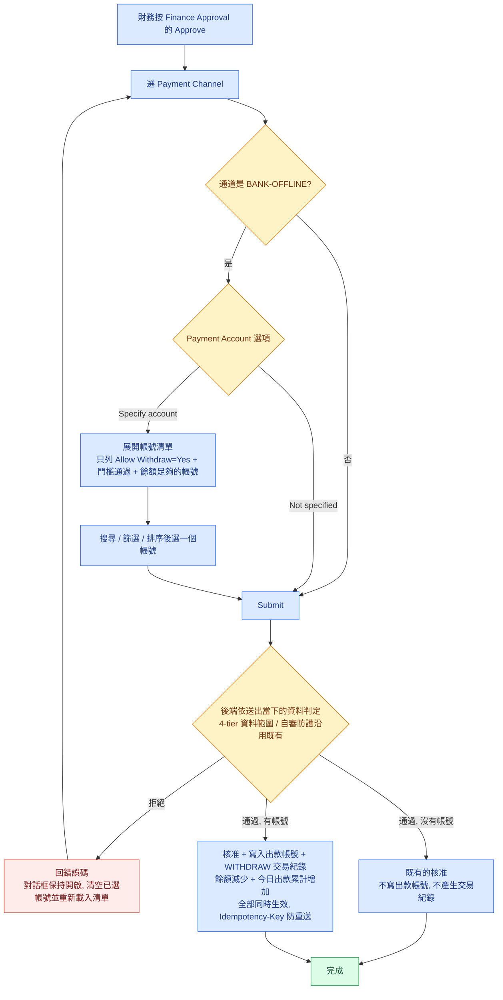
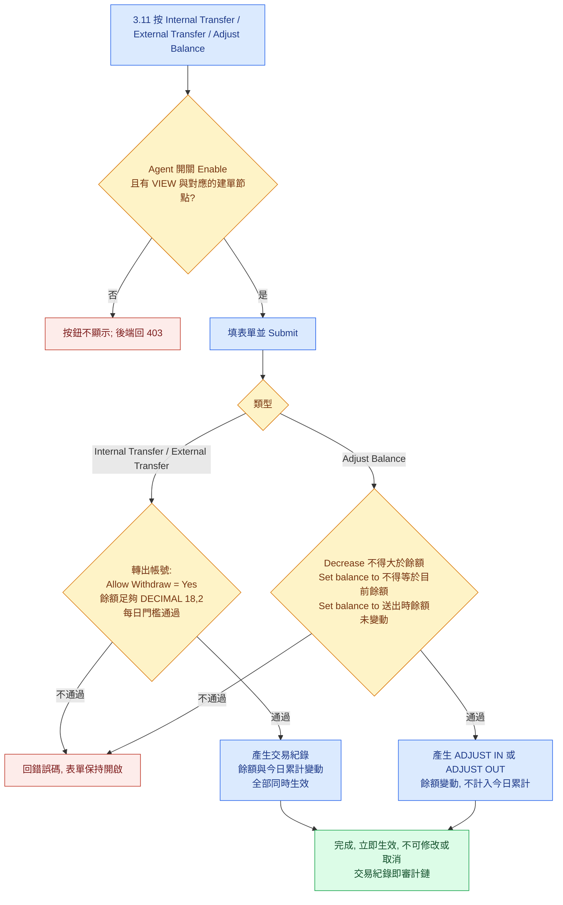

# PRD：Payment Account 管理（出款指定帳號、帳號餘額與手動單）

**版本**：v1.2（2026-10-09）　**類型**：新功能＋功能變更　**負責**：PM
**Mockup**：[Agent BO（3.2／3.7／3.11）](https://guswei.github.io/betally-bo-mockup/withdraw-payment-account/withdraw_payment_account_mockup.html)、[Admin BO（Role Setting）](https://guswei.github.io/betally-bo-mockup/withdraw-payment-account/withdraw_payment_account_mockup_admin.html)、[操作示範影片（約 2 分鐘）](https://guswei.github.io/betally-bo-mockup/withdraw-payment-account/withdraw_payment_account_demo.mp4)。兩份 mockup 都可切換「顯示 RD 註記」；Agent BO 的 mockup 可切換 `3.11` 的五個權限節點，Admin BO 的 mockup 可操作 Agent 的 `Enable`／`Deny`
**相關**：RD Spec `withdraw_payment_account_spec.md` v0.24（欄位、錯誤碼、介面欄位的完整定義）

## 1. 需求背景
客戶在 `BANK-OFFLINE` 通道底下有兩百多個公司銀行帳號，同時用來收玩家存款與付玩家出款。現在財務在 `3.2 Withdraw List` 核准出款時只能選通道，不能指定由哪個帳號付款；系統也不知道每個帳號裡還有多少錢。客戶目前用 Excel 逐筆記錄每個帳號的存款、出款、內部調撥、銀行手續費、利息、未認領的入帳與借貸，每天人工對帳。

受影響的是 Agent BO 的財務人員，以及在 Admin BO 管理 Agent 設定的營運人員。

本案讓系統記錄每個 `BANK-OFFLINE` 帳號的餘額與每一筆變動，取代客戶的 Excel：核准出款時可以指定出款帳號，玩家存款與出款自動入帳，新增 `3.11 Payment Account Transactions` 頁查交易紀錄、看每帳號合計，並建立內部轉帳、轉到外部、調整餘額三種手動單。Admin BO 可以決定每個 Agent 能不能使用 `3.11`。

本案只處理 `BANK-OFFLINE` 通道的帳號。其他通道、出款單的狀態流程、`9.5`／`12.5 Payment Report` 都不改動。

## 2. 核心功能變更
| # | 變更 (FR) | 說明 |
|---|---|---|
| FR-1 | `3.7` 出款設定 | `3.7 Payment Account` 新增 `Allow Deposit`、`Allow Withdraw`、`Withdraw Threshold`（每日出款門檻）、`Allow Withdraw Over Threshold`。只有 `BANK-OFFLINE` 帳號可以設定；其他通道的帳號 `Allow Deposit` 固定 Yes、`Allow Withdraw` 固定 No。`Allow Deposit = No` 的帳號不再派給之後的玩家存款；已建立的存款單記錄的收款帳號不變。 |
| FR-2 | `3.7` 餘額與即時狀態 | `3.7` 顯示唯讀的 `Balance` 與 `Today Withdraw Amount`。列表的 `Threshold`、`Withdraw Threshold` 兩欄加進度條；`BANK-OFFLINE` 帳號的 `Actions` 多一個 `Transactions` 按鈕，跳到 `3.11` 並以該帳號篩選。 |
| FR-3 | `3.7` 帳號代碼與分組 | 新增選填的 `Account Code`、`Account Group`，供客戶管理帳號，不填不影響任何功能。所有找帳號的地方可用代碼搜尋並顯示代碼；`3.7` 與 `3.11` 可依分組篩選。分組輸入時提示既有分組，只差大小寫的沿用既有寫法。 |
| FR-4 | `3.7` 通道不可搬移 | 帳號是不是 `BANK-OFFLINE` 帳號在新增時決定，之後不能改進或改出 `BANK-OFFLINE`。停用與刪除沿用既有功能；已刪除帳號的交易紀錄保留。 |
| FR-5 | 核准時指定出款帳號 | Finance Approval 的核准對話框選 `BANK-OFFLINE` 時，多一個 `Payment Account` 選項：`Not specified`（預設）或 `Specify account`。選 `Specify account` 時展開可搜尋、篩選、排序、分頁的帳號清單，只列出這張單能用的帳號。 |
| FR-6 | 出款單記錄出款帳號 | 指定帳號核准成功時，出款單記錄帳號 ID 與核准當下的銀行、戶名、帳號、錢包地址，之後不可修改。`3.2` 兩張表新增四欄、新增 `Payment Account` 篩選、`Export CSV` 帶出四欄。 |
| FR-7 | 帳號餘額與交易紀錄 | 系統記錄每個 `BANK-OFFLINE` 帳號的餘額。玩家存款核准產生 `DEPOSIT`（金額等於該存款單計入 `Today Deposit Amount` 的金額，同一張存款單只產生一筆）、指定帳號的出款核准產生 `WITHDRAW`、手動單產生對應紀錄，每筆記錄前後餘額。餘額不可為負；交易紀錄不可修改或刪除。上線時餘額為 0，不回補歷史。 |
| FR-8 | 每日出款門檻 | 指定帳號出款、內部轉帳的轉出、轉到外部，三種轉出都要通過：`Allow Withdraw = Yes`、餘額足夠、每日門檻。轉出計入 `Today Withdraw Amount`，依生效時間（出款是核准時間）歸屬當日，用交易金額本身、不扣手續費，計入後不因出款單狀態變化扣回。內部轉入計入既有的 `Today Deposit Amount`，轉入本身不受存款門檻限制，但累計達到 `Threshold` 後該帳號不再派給玩家存款。調整不計入任何累計。 |
| FR-9 | `3.11` 交易紀錄頁 | 新頁 `3.11 Payment Account Transactions`：篩選（帳號、分組、銀行、戶名、帳號號碼、單號、經手人、類型、日期區間）、摘要卡（未選帳號時是全部帳號總覽，選了帳號時是該帳號狀態）、交易列表、`Total In`／`Total Out`、`Export CSV`。日期區間預設今天，最長 31 天。 |
| FR-10 | `3.11` 每帳號合計 | `3.11` 可切換到 `Summary by Account`：每個帳號一列，列出日期區間內存款、出款、內部轉出、內部轉入、轉到外部、調整增加、調整減少的合計，最下面一列總計，可匯出。 |
| FR-11 | 手動單：Internal Transfer | 從一個 `BANK-OFFLINE` 帳號轉到另一個，產生成對的 `INTERNAL OUT`／`INTERNAL IN`，同一單號、同時生效。 |
| FR-12 | 手動單：External Transfer | 從 `BANK-OFFLINE` 帳號轉給系統外的對象，產生 `EXTERNAL OUT`，記錄對方資料與用途。 |
| FR-13 | 手動單：Adjust Balance | 增加、減少或直接設定帳號餘額（`Set balance to`）。`Remark` 必填。表單沒有類別欄位；調整的原因寫在 `Remark`。未認領的入帳先加後沖。`Set balance to` 送出時，帳號餘額與表單上顯示的不同就不建單，請使用者確認後重送。 |
| FR-14 | 權限節點 | Agent BO `11.2 Role Setting` 新增群組 `Payment Account Transactions`，含控制 `3.11` 的五個節點：`VIEW`、`EXPORT`、`Internal Transfer`、`External Transfer`、`Adjust Balance`，上線預設都不勾。後端逐一驗權。 |
| FR-15 | Admin BO 開關 | Admin BO `Agent List › Edit › Role Setting` 新增一列 `Payment Account Transactions`（`Enable`／`Deny`，預設 `Deny`）。`Deny` 的 Agent 不能使用 `3.11`；`3.2` 與 `3.7` 的新功能不受它控制。 |

範圍內（IN）：Agent BO 的 `3.2 Withdraw List`（Finance Approval 核准對話框、列表、篩選、匯出）、`3.7 Payment Account`（列表、新增、編輯）、`3.11 Payment Account Transactions`（新頁）、`11.2 Role Setting`；玩家存款核准時的入帳；Admin BO 的 `Agent List › Edit › Role Setting`。範圍外（OUT）：`BANK-OFFLINE` 以外的通道；帳號在通道之間搬移；`Payment Level`；`Force Approve`、`New Withdraw`、Risk Verification 與 `2.5 Risk Automation Process`；核准後修改出款帳號；既有出款單回補；一張出款單由多個帳號分開付款（以 `Not specified` 核准後用調整處理）；手動單的審核、修改、取消、刪除與手續費欄位；`9.5`、`12.5`、`9.17`、`9.18`、`9.19`、`3.9`、`3.1` 的畫面。

## 3. 介面設計
畫面見表頭的 Mockup 連結。重點：
- **`3.2` 核准對話框**：新增唯讀 `Amount`；選 `BANK-OFFLINE` 後出現 `Payment Account` 選項。`Specify account` 時對話框變寬，清單欄位為 `Code`、`Bank`、`Account Name`、`Account No`、`Balance`、`Today Deposit / Threshold`、`Today Withdraw / Threshold`（藍色區段是這張單會增加的量）、`After This Withdrawal`，每頁 10 筆。清單上方有 `Account Code`、`Account Name`、`Account No` 三個文字搜尋欄位，以及 `Bank` 下拉與排序下拉。沒選帳號不能送出；後端拒絕時對話框保持開啟並重新載入清單。
- **`3.2` 列表**：`Payment Channel` 之後新增 `Payment Account Bank`、`Payment Account Name`、`Payment Account No`、`Payment Account Wallet Address` 四欄，沒有出款帳號顯示 `—`。篩選區新增 `Payment Account`（輸入後搜尋，最多 8 筆候選）。
- **`3.7` 列表**：現有 30 欄之後依序新增 `Allow Deposit`、`Allow Withdraw`、`Withdraw Threshold`、`Allow Withdraw Over Threshold`、`Balance`、`Account Code`、`Account Group`（第 31–37 欄），加入 `Columns Settings` 並預設顯示。篩選區新增 `Account Code`、`Account Group`。
- **`3.7` 編輯頁與新增頁**：七個新欄位插在 `Allow Deposit Over Threshold` 與 `Payment Level` 之間。其他通道的帳號，出款相關欄位與代碼、分組不可編輯並顯示 `Only available for BANK-OFFLINE accounts.`。編輯 `BANK-OFFLINE` 帳號時 `Payment Channel` 唯讀。
- **`3.11`**：上方篩選區與三個建單按鈕、`Export CSV`；中間摘要卡；下方 `Transactions`／`Summary by Account` 兩種檢視。交易列表 14 欄，`Details` 欄合併顯示玩家帳號、對方帳號與備註。`Account Name` 是純文字，不提供點擊篩選。
- **三張手動單表單**：帳號欄位是可輸入縮小範圍的下拉選單（提示文字 `Select or type to search`），只能從選項選取；選取後顯示餘額與今日出款。`Adjust Balance` 選 `Set balance to` 時即時顯示目前餘額與差額。
- **Admin BO `Role Setting`**：`Free Spin Report` 之後新增 `Payment Account Transactions` 一列，改選後出現 `SAVE` 按鈕，按了才儲存。

**BO 欄位表**：

| 欄位 | 型別/精度 | 必填 | 說明 / enum / 邊界 |
|---|---|---|---|
| `Allow Deposit` | `BOOLEAN` | 是 | 新增帳號預設 Yes。只有 `BANK-OFFLINE` 帳號可設 No；其他通道固定 Yes。前端＋後端都要擋 |
| `Allow Withdraw` | `BOOLEAN` | 是 | 新增 `BANK-OFFLINE` 帳號預設 Yes，既有帳號上線時 No；其他通道固定 No。前端＋後端都要擋 |
| `Withdraw Threshold` | `DECIMAL(18,2)` | `Allow Withdraw = Yes` 時必填 | 大於 0、最多兩位小數、不大於 `9999999999999999.99`。禁 float。前端＋後端都要擋。`Allow Withdraw = No` 時不可編輯、不驗證，已存的值保留，改回 Yes 時帶出 |
| `Allow Withdraw Over Threshold` | `BOOLEAN` | `Allow Withdraw = Yes` 時必填 | 預設 No。Yes＝今日累計未達門檻即可轉出，最後一筆可超過；No＝累計加本筆不得超過門檻。`Allow Withdraw = No` 時不可編輯、已存的值保留 |
| `Balance` | `DECIMAL(18,2)` | 唯讀 | 不接受請求寫入。其他通道顯示 `-` |
| `Today Withdraw Amount` | `DECIMAL(18,2)` | 唯讀 | 與 `Today Deposit Amount` 同一切日基準歸零 |
| `Account Code` | `VARCHAR(32)` | 否 | 只限 `BANK-OFFLINE` 帳號；去前後空白；不檢查重複 |
| `Account Group` | `VARCHAR(32)` | 否 | 只限 `BANK-OFFLINE` 帳號；去前後空白；與既有分組只差大小寫時存成既有寫法 |
| `Payment Account`（核准對話框） | 畫面上二選一（`Not specified`／`Specify account`）；核准請求只多一個選填的帳號 ID | 選 `BANK-OFFLINE` 時顯示 | 預設 `Not specified`，請求不帶帳號 ID。選 `Specify account` 時必須選一個帳號，請求帶該帳號 ID |
| `Amount`（手動單） | `DECIMAL(18,2)` | 是 | 大於 0、最多兩位小數；轉出與 `Decrease` 不得大於餘額。前端＋後端都要擋 |
| `Actual Balance`（`Set balance to`） | `DECIMAL(18,2)` | 是 | 大於等於 0，不得等於目前餘額。請求另帶表單上顯示的目前餘額；後端讀到的餘額與它不同時回 `409 BALANCE_CHANGED`。前端＋後端都要擋 |
| `Direction` | `enum('INCREASE','DECREASE','SET')` | 是 | 預設 `DECREASE` |
| `Remark` | `VARCHAR(200)` | 調整必填；內部轉帳選填 | — |
| `Purpose` | `VARCHAR(200)` | 是（External Transfer） | — |
| `Recipient Bank`／`Recipient Account Name`／`Recipient Account No` | `VARCHAR(64)`／`VARCHAR(64)`／`VARCHAR(32)` | 否 | 戶名與帳號 AES-256 加密 |
| `Tx ID`（External Transfer） | `VARCHAR(64)` | 否 | 銀行交易序號 |
| `Payment Account Transactions`（Admin BO） | `BOOLEAN` | 是 | 每個 Agent 一個，預設 `false`（`Deny`） |

## 4. 資料模型
邏輯資料如下，實際表名、欄位名與索引方式由 RD 依既有命名決定。金額一律 `DECIMAL(18,2)`。

| Table | 欄位 | 型別 | 約束 |
|---|---|---|---|
| Payment Account（既有） | `allow_deposit` | `BOOLEAN` | NOT NULL，DEFAULT true |
| Payment Account（既有） | `allow_withdraw` | `BOOLEAN` | NOT NULL；其他通道恆為 false |
| Payment Account（既有） | `withdraw_threshold` | `DECIMAL(18,2)` | NULL 可；有值時 > 0 |
| Payment Account（既有） | `allow_withdraw_over_threshold` | `BOOLEAN` | NOT NULL，DEFAULT false |
| Payment Account（既有） | `balance` | `DECIMAL(18,2)` | NOT NULL，DEFAULT 0，CHECK ≥ 0 |
| Payment Account（既有） | `today_withdraw_amount` | `DECIMAL(18,2)` | NOT NULL，DEFAULT 0，與今日存款累計同時歸零 |
| Payment Account（既有） | `account_code`、`account_group` | `VARCHAR(32)` | NULL 可 |
| 出款單（既有） | `payment_account_id` | 與帳號 ID 相同 | NULL 可；寫入後不可修改 |
| 出款單（既有） | `payment_account_bank_name`、`payment_account_name`、`payment_account_no`、`payment_account_wallet_address` | 字串，長度同 `3.7` 對應欄位 | NULL 可；後三者 AES-256 加密；核准當下的值 |
| 帳號交易紀錄（新增） | 帳號 ID、`type`、`amount`、`balance_before`、`balance_after`、`reference_no`、`created_by`、`created_time` | `type`：`enum('DEPOSIT','WITHDRAW','INTERNAL OUT','INTERNAL IN','EXTERNAL OUT','ADJUST IN','ADJUST OUT')`；金額三欄 `DECIMAL(18,2)` | NOT NULL；`amount` > 0；`balance_after` ≥ 0；建立後不可修改或刪除 |
| 帳號交易紀錄（新增） | 交易當下的 `account_code`、`bank_name`、`account_name`、`account_no` | 字串 | 戶名與帳號 AES-256 加密 |
| 帳號交易紀錄（新增） | `player`、`counterparty`、`remark`、`tx_id` | 字串 | `counterparty` AES-256 加密 |
| 帳號交易紀錄（新增） | 來源單據 | 存款單 ID／出款單 ID／手動單號 | 同一張存款單只有一筆 `DEPOSIT`；同一張出款單只有一筆 `WITHDRAW` |
| Agent 設定（Admin BO，既有） | `payment_account_transactions` | `BOOLEAN` | NOT NULL，DEFAULT false |

Migration 方向：既有帳號 `allow_deposit = true`、`allow_withdraw = false`、`allow_withdraw_over_threshold = false`、`balance = 0`、代碼與分組為空；既有出款單的出款帳號欄位為空；所有 Agent 的開關為 `false`。不回補歷史交易。

## 5. 流程圖
核准出款（指定帳號）：

手動單：

## 6. 選單位置
Agent BO 新增 `3.11` 一個選單項；`3.2`、`3.7` 沿用現有選單。Admin BO 沿用現有頁面，新增一列設定。

| 選單路徑 | 角色 / 權限 | 說明 |
|---|---|---|
| Agent BO：`3. Payment Management` › `3.11 Payment Account Transactions`（新增，排在 `3.10 Manual Balance Adjustment` 之後） | Admin BO 開關為 `Enable` 的 Agent；角色具 `3.11 › VIEW`。建單與匯出另需 `Internal Transfer`、`External Transfer`、`Adjust Balance`、`EXPORT` 節點 | 查交易紀錄與每帳號合計、建手動單。資料範圍限登入者所屬代理（4-tier 既有規則） |
| Agent BO：`3. Payment Management` › `3.2 Withdraw List` | 沿用 Finance Approval 的 Approve 權限與 `3.2` 既有檢視、匯出權限 | 核准時指定出款帳號；看出款帳號欄位與篩選 |
| Agent BO：`3. Payment Management` › `3.7 Payment Account` | 沿用 `3.7` 既有的檢視、新增、編輯權限 | 設定出款門檻、代碼與分組；看餘額 |
| Agent BO：`11.2 Role Setting` › `Payment Management` | 沿用 `11.2` 既有權限 | 新增群組 `Payment Account Transactions` 與五個節點，上線預設不勾；Admin BO 開關為 `Deny` 時不顯示 |
| Admin BO：`Agent-Setting` › `Agent List` › `Edit` › `Role Setting` | 沿用 `Agent List` 既有的編輯權限 | 新增 `Payment Account Transactions` 一列，決定該 Agent 能不能使用 `3.11` |

## 7. 驗收標準（AC）
| AC-ID | 對應 FR | 驗收條件 |
|---|---|---|
| AC-01 | FR-1 | 新增 `BANK-OFFLINE` 帳號時 `Allow Deposit`、`Allow Withdraw` 預設 Yes，`Withdraw Threshold` 必填；填 `50000` 儲存成功，列表 `Withdraw Threshold` 顯示 `0.00 / 50,000.00`。 |
| AC-02（負向） | FR-1 | `Allow Withdraw = Yes` 而 `Withdraw Threshold` 留空、為 0、為負數、超過兩位小數或大於 `9999999999999999.99` 時，前端擋下；直接呼叫後端回 `400 WITHDRAW_THRESHOLD_REQUIRED` 或 `400 WITHDRAW_THRESHOLD_INVALID`，資料不變。 |
| AC-03 | FR-1 | 帳號原本 `Withdraw Threshold = 50,000`、`Allow Withdraw Over Threshold = Yes`。把 `Allow Withdraw` 改成 No 儲存：兩個欄位不可編輯、不驗證，已存的值保留；之後改回 Yes，兩個欄位帶出 `50,000` 與 Yes。 |
| AC-04（負向） | FR-1 | 其他通道的帳號（例如 `QRIS-OFFLINE`）：`Allow Deposit` 固定 Yes、`Allow Withdraw` 固定 No 不可改；請求帶了不同的值，後端以固定值儲存；派收款帳號的行為與上線前相同。 |
| AC-05 | FR-1 | `BANK-OFFLINE` 帳號 X 改成 `Allow Deposit = No` 後，之後的玩家存款不會被派到 X；通道底下所有帳號都不可用時，前台不顯示該存款通道。改設定前已建立、收款帳號是 X 的存款單 D：D 記錄的收款帳號仍是 X，核准沿用既有檢查，核准成功時依 AC-19 在 X 產生 `DEPOSIT`。 |
| AC-06 | FR-2 | `3.7` 列表第 35 欄顯示 `BANK-OFFLINE` 帳號的餘額，其他通道顯示 `-`；`BANK-OFFLINE` 帳號的 `Threshold` 與 `Withdraw Threshold` 進度條未達 80% 綠、80% 以上橘、100% 以上紅。Agent 的 Admin BO 開關為 `Enable` 且使用者有 `3.11 › VIEW` 時，`BANK-OFFLINE` 帳號有 `Transactions` 按鈕，點了跳到 `3.11` 並以該帳號篩選。 |
| AC-07（負向） | FR-2 | 新增與編輯請求帶 `balance` 或 `todayWithdrawAmount` 時，後端不接受，帳號餘額與累計不變。 |
| AC-08 | FR-3 | 帳號設 `Account Code = A-101` 後，核准對話框、手動單下拉、`3.2` 與 `3.11` 篩選都能用 `a-101` 找到該帳號，且帳號標示開頭是 `A-101 - `。代碼與分組不填時，出款核准、餘額、手動單都照常運作。 |
| AC-09 | FR-3 | 已有分組 `GRP-B`，在另一個帳號輸入 `  grp-b ` 儲存，存成 `GRP-B`；`3.7` 的 `Account Group` 篩選選 `GRP-B` 只列該分組的帳號，選 `No Group` 只列沒有分組的 `BANK-OFFLINE` 帳號；`3.11` 選 `GRP-B` 只列目前屬於該分組的帳號的交易。 |
| AC-10（負向） | FR-4 | 編輯 `BANK-OFFLINE` 帳號時 `Payment Channel` 唯讀；編輯其他通道的帳號時選項不含 `BANK-OFFLINE`。直接呼叫後端把帳號改進或改出 `BANK-OFFLINE`，回 `400 PAYMENT_CHANNEL_NOT_CHANGEABLE`，帳號不變。 |
| AC-11 | FR-4 | 刪除有交易紀錄的 `BANK-OFFLINE` 帳號後：帳號不出現在 `3.7` 列表、核准對話框的帳號清單、手動單下拉與各篩選的帳號候選；它的交易紀錄仍可在 `3.11` 用帳號號碼查到；已核准出款單上記錄的帳號資料不變。 |
| AC-12 | FR-5 | 核准對話框選 `BANK-OFFLINE`＋`Not specified` 可直接送出，核准成功後出款單沒有出款帳號，各帳號餘額與今日出款累計都不變。 |
| AC-13 | FR-5 | 選 `Specify account` 時，清單只列 `ACTIVE`、`Allow Withdraw = Yes`、餘額 ≥ 出款金額、且依每日門檻可轉出的帳號；筆數顯示 `{n} of {m} accounts`；未選帳號時 `Submit` 不可按。 |
| AC-14（負向） | FR-5 | 對話框開啟後，所選帳號被停用、刪除或 `Allow Withdraw` 改成 No 時，送出回 `409 PAYMENT_ACCOUNT_UNAVAILABLE`；餘額不足回 `409 PAYMENT_ACCOUNT_INSUFFICIENT_BALANCE`；依門檻不可轉出回 `409 PAYMENT_ACCOUNT_THRESHOLD_EXCEEDED`。出款單、交易紀錄、餘額、累計都不變，對話框保持開啟、清空已選帳號並重新載入清單。 |
| AC-15（負向） | FR-5 | 以 `BANK-OFFLINE` 以外的通道核准、請求卻帶了帳號 ID，後端回 `400 PAYMENT_ACCOUNT_NOT_APPLICABLE`。帶了不屬於登入者所屬代理的帳號 ID，一律拒絕。 |
| AC-16 | FR-5 | 送出後沒有收到後端回應時，對話框顯示 `Unable to confirm the result. Please check the order status before trying again.`，不顯示成核准失敗；財務查到這張單已核准時，不會再產生第二筆 `WITHDRAW`。 |
| AC-17 | FR-6 | 指定帳號 X 核准出款 1,500.00 成功：出款單記錄 X 的 ID 與核准當下的銀行、戶名、帳號；`3.2` 四個新欄位顯示這些值；`Payment Account` 篩選選 X 查得到這張單；`Export CSV` 帶出四欄。之後在 `3.7` 修改 X 的戶名，出款單上的值不變。 |
| AC-18（負向） | FR-6 | 同一張出款單由兩位財務同時核准，只有一位成功；同一核准請求重送（同一 `Idempotency-Key`），不重複轉換狀態、不重複產生 `WITHDRAW`、不重複扣餘額與累計。出款帳號寫入後沒有任何修改入口。 |
| AC-19 | FR-7 | 收款帳號是 `BANK-OFFLINE` 帳號的存款核准成功時，同時產生一筆 `DEPOSIT`、餘額增加、今日存款累計增加；`DEPOSIT` 的金額等於這張存款單計入 `Today Deposit Amount` 的金額，`Reference No` 是存款單號，`Details` 顯示 `Player: {玩家帳號}`。 |
| AC-20（負向） | FR-7 | 同一張存款單的核准請求重送或被重複處理，只會有一筆 `DEPOSIT`、餘額只加一次；核准失敗時存款單、交易紀錄、餘額、累計都不變。 |
| AC-21（負向） | FR-7 | 任何會讓餘額小於 0 的動作（指定帳號出款、轉出、`Decrease`）都被拒絕。會讓某個帳號的餘額或今日累計超過 `9999999999999999.99` 時：核准出款與手動單回 `409 AMOUNT_LIMIT_EXCEEDED`、整筆不生效；玩家存款核准則核准失敗、存款單狀態不變，依既有的核准失敗方式回應。 |
| AC-22 | FR-7 | 任一帳號在任何時刻：餘額等於全部交易紀錄的帶號加總；每筆 `Balance Before` 等於同帳號前一筆的 `Balance After`。上線時所有 `BANK-OFFLINE` 帳號餘額為 0，沒有交易紀錄。 |
| AC-23 | FR-8 | `Withdraw Threshold = 50,000`、今日已轉出 48,000、餘額足夠：`Allow Withdraw Over Threshold = Yes` 時轉出 3,000 可以（累計 51,000），之後任何金額都不行；`= No` 時轉出 2,000 可以、3,000 不行。 |
| AC-24（負向） | FR-8 | `Allow Withdraw = No` 的帳號不出現在核准清單、不能做內部轉帳的轉出與轉到外部（回 `409 WITHDRAW_NOT_ALLOWED`），但可以做內部轉入與調整餘額。同一帳號同時發生兩個轉出時，後完成的依前一個完成後的餘額與累計判定，餘額不會小於 0；以 AC-23 的條件同時送出兩筆 3,000：`Allow Withdraw Over Threshold = Yes` 時第一筆成功（累計 51,000）、第二筆被拒；`= No` 時兩筆都被拒。 |
| AC-25 | FR-8 | 內部轉入 1,000 後，轉入帳號的 `Today Deposit Amount` 增加 1,000；轉入本身不受存款門檻限制；累計因此達到 `Threshold` 的帳號，不再被派給玩家存款。調整餘額不改變任何累計。今日累計在既有的切日時刻歸零。 |
| AC-26 | FR-8 | 昨天建立、今天核准的出款單，計入今天的 `Today Withdraw Amount`；計入的是交易金額本身，不扣手續費；之後這張出款單的狀態再有變化，已計入的累計不扣回。 |
| AC-27 | FR-9 | Agent 開關為 `Enable`、有 `3.11 › VIEW` 的使用者直接進入 `3.11`：日期區間預設為今日累計這一期（最近一次歸零到下一次歸零前一秒），摘要卡顯示全部帳號總覽（帳號數、餘額合計、今日存款合計、今日出款合計），列表依 `Created Time` 由新到舊、每頁 10 筆；選了帳號後摘要卡改顯示該帳號狀態。 |
| AC-28（負向） | FR-9、FR-10 | 日期區間超過 31 天時前端不可查詢並顯示 `Date range cannot exceed 31 days.`；直接呼叫後端回 `400 DATE_RANGE_TOO_LONG`。交易列表、`Summary by Account` 的查詢與兩種匯出都受此限制。 |
| AC-29 | FR-9 | 篩選條件同時套用到列表、`Total In`／`Total Out` 與 `Export CSV`；`Bank` 選項含已改銀行或已刪除帳號的歷史銀行；`Export CSV` 匯出全部符合的紀錄（不只本頁）共 16 欄；`Amount` 不加千分位，減少的金額前面加 `-`，增加的金額不加符號。交易列表的 `Account Name` 是純文字，點了不改變篩選條件。 |
| AC-30 | FR-10 | 切到 `Summary by Account`：每個有交易的帳號一列，各金額欄等於該帳號在條件範圍內對應類型的合計，`Adjust In` 是 `ADJUST IN` 的合計、`Adjust Out` 是 `ADJUST OUT` 的合計；`Total` 列等於全部列（不只本頁）合計；`Account Name` 是純文字，點了仍停在合計表。已刪除帳號仍列出一列並計入 `Total`：代碼、銀行、戶名、帳號用範圍內最新一筆交易當下的值，`Account Group`、`Status`、`Balance` 顯示 `-`。匯出 14 欄、全部列，不含 `Total` 列。 |
| AC-31（負向） | FR-10 | 沒有 `3.11 › VIEW` 時查詢 `Summary by Account` 回 `403`；有 `VIEW` 沒有 `EXPORT` 時看不到 `Export CSV`，直接呼叫匯出回 `403`。 |
| AC-32 | FR-10 | 昨天帳號 A、B 各有一筆 `6000000000000000.00` 的存款：查昨天的 `Summary by Account`，`Total` 列的 `Deposit` 顯示 `12,000,000,000,000,000.00`，不截斷、不報錯。 |
| AC-33 | FR-9 | 同一代理、未刪除的帳號 A、B 目前餘額各為 `6000000000000000.00`，沒有選定帳號時，總覽卡的 `Total Balance` 顯示 `12,000,000,000,000,000.00`，不截斷、不報錯。 |
| AC-34 | FR-11 | 帳號 A（餘額 10,000）轉 1,000 到帳號 B：產生 `INTERNAL OUT`（A）與 `INTERNAL IN`（B）兩筆，同一 `IT` 開頭的單號、同時生效；A 餘額 9,000、今日出款 +1,000；B 餘額 +1,000、今日存款 +1,000。 |
| AC-35（負向） | FR-11 | 轉出與轉入選同一個帳號回 `400 SAME_ACCOUNT`；轉入帳號是 `INACTIVE` 時不在選項中、直接呼叫回 `409 PAYMENT_ACCOUNT_INACTIVE`；任一邊不能生效時兩筆都不產生。 |
| AC-36 | FR-12 | 填 `Recipient Bank = KBANK`、`Recipient Account Name = ACME Co`、`Recipient Account No = 123456`、`Purpose = Rent`，轉出 500：產生一筆 `EXTERNAL OUT`（`ET` 開頭單號），餘額 −500、今日出款 +500，`Details` 顯示 `To: KBANK / ACME Co / 123456 · Rent`。 |
| AC-37 | FR-12 | 對方三個欄位都不填、只填 `Purpose = Rent`：可以建單，`Details` 只顯示 `Rent`。 |
| AC-38（負向） | FR-12 | `Purpose` 沒填回 `400 PURPOSE_REQUIRED`；金額大於餘額回 `409 PAYMENT_ACCOUNT_INSUFFICIENT_BALANCE`；不建單、餘額不變。 |
| AC-39 | FR-13 | 帳號餘額 1,200，選 `Set balance to` 填 `80000`、`Remark` 填 `Opening balance`：畫面即時顯示 `Current balance: 1,200.00 · Difference: +78,800.00`；送出後產生一筆 `ADJUST IN` 78,800.00，餘額 80,000.00，今日累計不變。 |
| AC-40（負向） | FR-13 | 表單開著時（畫面顯示餘額 1,200），同帳號先有一筆存款入帳 300；之後送出 `Set balance to 80000`：後端回 `409 BALANCE_CHANGED`，不建單，餘額維持 1,500.00；表單保持開啟，顯示 `The balance changed to 1,500.00. Check the Actual Balance. Submit again.`，帳號欄位下方的 `Balance` 與 `Current balance` 都更新為 1,500.00、`Difference` 更新為 +78,500.00。使用者再按一次 `Submit`（新的請求，使用新的 `Idempotency-Key`）：產生 `ADJUST IN` 78,500.00，餘額 80,000.00。同樣情況下送出 `Decrease 10`：照常建單，不回 `BALANCE_CHANGED`。 |
| AC-41 | FR-13 | 未認領入帳：先 `Increase` 300（`Remark` 寫明是未認領的入帳），存款單核准後再 `Decrease` 300；兩筆都出現在 `3.11`，`Details` 只顯示各自的 `Remark`；合計表 `Adjust In` 與 `Adjust Out` 各增加 300，餘額淨增加的只有那筆 `DEPOSIT`。 |
| AC-42（負向） | FR-13 | `Decrease` 金額大於餘額回 `409 PAYMENT_ACCOUNT_INSUFFICIENT_BALANCE`；`Set balance to` 金額等於目前餘額回 `409 BALANCE_UNCHANGED`；餘額變動與金額等於新餘額同時成立時，先回 `409 BALANCE_CHANGED`，更新後再送出才回 `409 BALANCE_UNCHANGED`；`Set balance to` 的請求沒有 `expectedBalance`、或它不是大於等於 0 且最多兩位小數的數字時，回 `400 EXPECTED_BALANCE_INVALID`，不建單；`Remark` 沒填回 `400 REMARK_REQUIRED`；表單與請求都沒有類別欄位；調整建立後沒有修改、取消、刪除入口。 |
| AC-43 | FR-14 | Agent 開關為 `Enable`、第一次開通時，所有角色的五個節點都不勾；只勾 `VIEW` 的角色看得到 `3.11` 但看不到三個建單按鈕與 `Export CSV`；再加勾 `Internal Transfer` 時只多出 `Internal Transfer` 按鈕。 |
| AC-44（負向） | FR-14 | 沒有 `VIEW` 的使用者呼叫 `3.11` 任何介面回 `403`；有 `VIEW` 但缺 `EXPORT`、`Internal Transfer`、`External Transfer` 或 `Adjust Balance` 的，只有對應的匯出或建單回 `403`、不建單，查詢照常。表單開著時權限被收回，送出也回 `403`。 |
| AC-45 | FR-15 | 從未開通過的 Agent，Admin BO 把 `Payment Account Transactions` 改成 `Enable` 並按 `SAVE` 後，該 Agent 的 `11.2 Role Setting` 出現群組 `Payment Account Transactions` 與五個節點，全部不勾。 |
| AC-46（負向） | FR-15 | `Deny` 的 Agent：`11.2 Role Setting` 不顯示 `3.11` 節點，所有帳號（含最高權限）選單不顯示 `3.11`，`3.7` 不顯示 `Transactions` 按鈕，呼叫 `3.11` 任何介面回 `403`。由 `Enable` 改回 `Deny` 後立即生效，角色原本的勾選保留不清除，再改回 `Enable` 後恢復原本的勾選。改選但沒按 `SAVE` 時設定不變。 |
| AC-47 | FR-15 | `Deny` 的 Agent 仍可在 `3.2` 指定出款帳號、在 `3.7` 看到新欄位；玩家存款與指定帳號的出款照常產生交易紀錄並變動餘額。 |

## 8. 非功能需求（NFR）
| NFR-ID | 類別 | 需求 |
|---|---|---|
| NFR-REL | 可靠性 | 不破壞既有功能：其他通道的帳號、派收款帳號（本案只新增排除 `Allow Deposit = No` 的帳號）、`Force Approve`、`New Withdraw`、Risk Verification、出款單狀態流程、存款核准的既有檢查與畫面都不變。金流動作（核准出款、存款入帳、手動單）各自的交易紀錄、餘額、累計變動同時生效或同時不生效；同一帳號的並行轉出依序判定；核准與建單請求帶 `Idempotency-Key`，重送不重複入帳。後端在送出當下重新判定，不採信前端清單。 |
| NFR-DATA | 金額/資料精度 | 單筆交易金額、餘額、門檻、今日累計以 `DECIMAL(18,2)` 儲存與計算，介面以十進位字串傳遞，禁 float；這幾項的上限是 `9999999999999999.99`，交易會讓它們超過上限時整筆拒絕，不截斷、不進位。跨多筆或多帳號的合計（`Total In`／`Total Out`、總覽卡、合計表 `Total`）不受這個上限限制，保持兩位小數的精確十進位值完整回傳，不截斷。戶名、帳號、錢包地址、對方帳號 AES-256 加密，不寫入應用程式日誌。 |
| NFR-SEC | 權限與資料範圍 | 所有清單、下拉、篩選候選、交易紀錄只含登入者所屬代理的帳號（4-tier 既有範圍）；帶入其他代理的帳號 ID 或出款單 ID 一律拒絕。每個查詢與動作由後端各自驗權，不依前端傳入的用途決定。出款核准沿用既有的自審防護（建單者不可核准自己的單）。 |
| NFR-AUDIT | 審計 | 交易紀錄建立後不可修改或刪除，記錄建單人／核准人與時間，是餘額變動的審計鏈；`3.7` 六個可編輯新欄位的修改寫入 `11.9 Change Log`；出款帳號的寫入與出款單既有的 `Processed By`、`Processed Time` 屬同一次操作。 |
| NFR-PERF | 效能 | 帳號可達兩百個以上：核准對話框清單的搜尋、篩選、排序、分頁與可用判定由後端處理；`3.11` 查詢與匯出以 31 天為上限。 |

## 9. 假設與限制（ASM / CST）
| ID | 內容 |
|---|---|
| ASM-1 | 既有的 `Today Deposit Amount` 有固定的切日時刻；新增的 `Today Withdraw Amount` 與 `3.11` 預設的「今天」都以它為準。RD 確認該切日時刻與時區。 |
| ASM-2 | 玩家存款不論經由哪一種既有核准方式完成，凡計入 `Today Deposit Amount` 的，都能在同一次操作中產生 `DEPOSIT`。RD 確認既有的存款核准流程可以掛上這個動作。 |
| ASM-3 | `3.7` 既有的刪除功能，不論實作方式，刪除帳號後仍能保留並讀到該帳號的交易紀錄與已核准出款單上的帳號資料（AC-11）。RD 確認既有刪除方式能做到；刪除方式本身不在本案改動。 |
| ASM-4 | Admin BO `Role Setting` 新增的一列，讀取、儲存與 `updated :` 的格式可以沿用 `Free Spin`、`Free Spin Report` 既有的做法。 |
| ASM-5 | 未認領的入帳由財務人工先加後沖；存款核准到沖銷之間，同一筆錢在餘額中算兩次，系統不限制這段期間的轉出，靠財務在存款核准後立刻沖銷。 |
| CST-1 | 全部功能只適用於 `BANK-OFFLINE` 通道的帳號，以通道代碼辨識，不比對可修改的通道名稱。其他通道的行為與上線前完全相同。 |
| CST-2 | 不新增出款單狀態，不改出款單既有的狀態轉換；一張出款單最多指定一個出款帳號，核准後不可修改。 |
| CST-3 | 上線不回補歷史：餘額從 0 開始，既有出款單沒有出款帳號，上線前的存款與出款不產生交易紀錄。 |
| CST-4 | 下列畫面不改動：`9.5 Payment Report`、`12.5 Payment Report`、`9.17`／`9.18 Summary Report`、`9.19 Transaction Fee Report`、`3.9 Transactions Record`、`3.1 Deposit List`。 |
| CST-5 | 手動單沒有審核步驟，權限節點是唯一管制；手動單建立後不可修改、取消或刪除，更正一律以反向的單處理。 |
