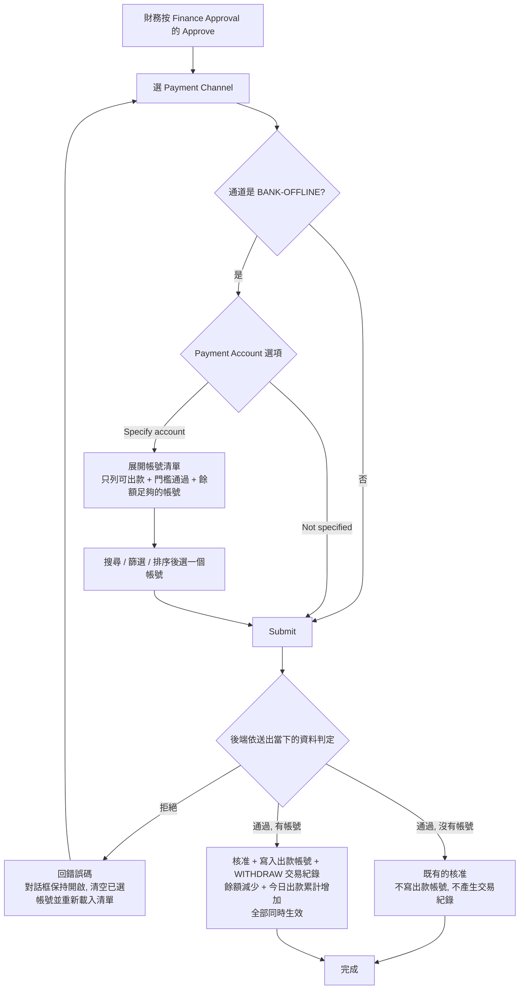
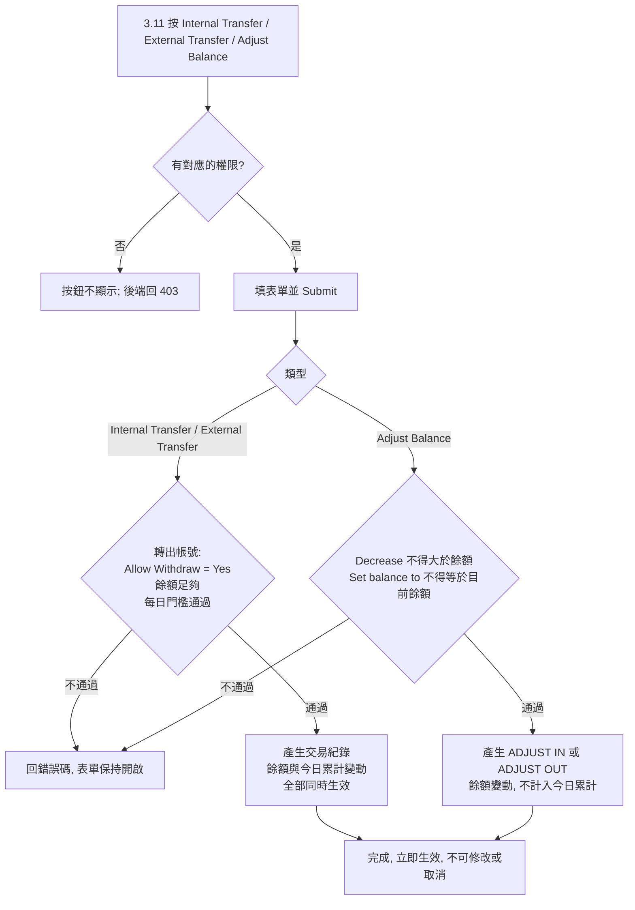

# Payment Account 管理：出款指定帳號、餘額與手動單（RD 開發 Spec）

- 對象系統：GCP Agent BO；Admin BO（13.4）
- 位置：Agent BO 的 `3.7 Payment Account`、`3.2 Withdraw List`、`3.11 Payment Account Transactions`（新頁）、`11.2 Role Setting`；Admin BO 的 `Agent-Setting › Agent List › Edit › Role Setting`
- 版本：v0.22（2026-10-05）

---

## 1. 背景與範圍

客戶在 `BANK-OFFLINE` 通道底下有兩百多個公司帳號，用來收玩家的存款，也用來付玩家的出款。目前系統不知道每筆出款是從哪個帳號付的，也不知道每個帳號裡有多少錢。

本次做五件事：

1. `3.7 Payment Account`：帳號可以設定能不能收款、能不能出款、每日出款門檻、帳號代碼與分組；並顯示系統記錄的餘額。
2. `3.2 Withdraw List`：Finance Approval 核准時選到 `BANK-OFFLINE`，財務可以選擇是否指定出款帳號；出款單記錄所選的帳號，列表、篩選與 CSV 帶出。
3. 帳號餘額：系統記錄每個帳號的餘額。玩家存款、玩家出款、手動單都會改變餘額。
4. `3.11 Payment Account Transactions`（新頁）：每個帳號的交易紀錄、每個帳號的分類合計表，以及三種手動單：內部轉帳、轉到外部、調整餘額。
5. 權限：新增五個權限節點；Admin BO 可以決定每個 Agent 能不能使用 `3.11`。

全部功能**只適用於 `BANK-OFFLINE`** 通道底下的帳號。 其他通道（不論線上或離線）的帳號與出款流程都不變。

不新增出款單狀態，不改出款單既有的狀態轉換。

---

## 2. 名詞

| 名詞 | 意思 |
|---|---|
| `BANK-OFFLINE` | `3.6 Payment Channel` 裡的 `BANK-OFFLINE` 通道。以系統的通道代碼辨識，不以可以修改的通道名稱比對 |
| Payment Account | `3.7 Payment Account` 的一筆帳號，屬於公司，掛在某一個通道底下 |
| BANK-OFFLINE 帳號 | 掛在 `BANK-OFFLINE` 底下的 Payment Account。本文的出款設定、餘額、交易紀錄、手動單都只針對這類帳號 |
| 出款帳號 | 核准出款時所選的那一筆 BANK-OFFLINE 帳號 |
| 玩家收款帳號 | 出款單上既有的 `Bank Name`、`Account Name`、`Bank Account No`、`Wallet Address`，是玩家收錢的帳號，與 Payment Account 無關 |
| 帳號標示 | 畫面上用來表示一個帳號的文字。有 `Account Code` 時是 `{Account Code} - {Bank Name} / {Account Name} / {Account No}`；沒有時是 `{Bank Name} / {Account Name} / {Account No}` |
| 餘額（`Balance`） | 系統記錄的帳號目前金額（第 4 節） |
| 手動單 | 在 `3.11` 由人員建立的內部轉帳、轉到外部、調整餘額 |

---

## 3. `3.7 Payment Account`

### 3.1 新增欄位

| UI 標籤 | 型別 | 必填 | 新增帳號的預設值 | 說明 |
|---|---|---|---|---|
| `Allow Deposit` | Yes／No | 是 | Yes | No 時，這個帳號不會派給玩家存款。只有 BANK-OFFLINE 帳號可以設成 No；其他通道的帳號固定 Yes |
| `Allow Withdraw` | Yes／No | 是 | BANK-OFFLINE 帳號 Yes；其他通道的帳號固定 No | 能不能從這個帳號轉出錢。Yes 時這個帳號才能用於核准玩家出款、內部轉帳的轉出、轉到外部 |
| `Withdraw Threshold` | `DECIMAL(18,2)` | `Allow Withdraw = Yes` 時必填 | 空 | 每日出款門檻。必須大於 0，最多兩位小數，不得大於 `9999999999999999.99`。金額禁用 float |
| `Today Withdraw Amount` | `DECIMAL(18,2)` | 唯讀 | 0 | 今日從這個帳號轉出的金額合計（第 9 節） |
| `Allow Withdraw Over Threshold` | Yes／No | `Allow Withdraw = Yes` 時必填 | No | 最後一筆能不能讓今日出款累計超過門檻（第 6 節） |
| `Balance` | `DECIMAL(18,2)` | 唯讀 | 0 | 帳號目前的餘額（第 4 節）。只有 BANK-OFFLINE 帳號有值，其他通道的帳號顯示 `-` |
| `Account Code` | 文字，最長 32 字 | 否 | 空 | 客戶自己稱呼帳號用的代碼。不檢查是否與其他帳號重複。只有 BANK-OFFLINE 帳號可以填 |
| `Account Group` | 文字，最長 32 字 | 否 | 空 | 帳號的分組，例如帳號是從哪一個供應商取得的。不填就是沒有分組。只有 BANK-OFFLINE 帳號可以填 |

### 3.2 編輯頁與新增頁的欄位位置

現有 17 個欄位的順序不變：`ID`、`Sort`、`Payment Channel`、`Bank Name`、`Bank Branch Name`、`Account Name`、`Account No`、`Operator Fee`、`Min. Deposit (Fiat)`、`Max. Deposit (Fiat)`、`Deposit Player Fee`、`Min Deposit (Crypto)`、`Max Deposit (Crypto)`、`Threshold`、`Allow Deposit Over Threshold`、`Payment Level`、`Image`。

七個新欄位插在 `Allow Deposit Over Threshold` 與 `Payment Level` 之間，依序為：

1. `Allow Deposit`
2. `Allow Withdraw`
3. `Withdraw Threshold`，欄位下方顯示 `Today Withdraw Amount: {金額}`，顯示方式與既有 `Threshold` 下方的 `Today Deposit Amount` 相同
4. `Allow Withdraw Over Threshold`
5. `Balance`（唯讀）
6. `Account Code`
7. `Account Group`

新增頁（`Add`）的欄位與順序相同。

### 3.3 欄位連動與驗證（前端＋後端都要擋）

- `Payment Channel` 不是 `BANK-OFFLINE` 時，`Allow Deposit` 固定為 Yes、`Allow Withdraw` 固定為 No，兩個欄位都不可改，欄位下方各顯示 `Only available for BANK-OFFLINE accounts.`。在新增頁把 `Payment Channel` 改選為其他通道時，兩個欄位立即變成這兩個固定值。請求對其他通道的帳號帶了不同的值時，後端以固定值儲存。
- `Allow Withdraw = Yes` 時，`Withdraw Threshold` 留空或小於等於 0，回 `400 WITHDRAW_THRESHOLD_REQUIRED`，前端顯示 `Withdraw Threshold is required and must be greater than 0.`。
- `Withdraw Threshold` 超過兩位小數，或大於 `9999999999999999.99`，回 `400 WITHDRAW_THRESHOLD_INVALID`，前端顯示 `Withdraw Threshold is out of range or has more than 2 decimal places.`。
- `Allow Withdraw = No` 時，`Withdraw Threshold` 與 `Allow Withdraw Over Threshold` 不可編輯、不驗證，已存的值保留；之後改回 Yes 時帶出原值。
- 新增 BANK-OFFLINE 帳號時 `Allow Withdraw` 預設 Yes，所以 `Withdraw Threshold` 必須填寫才能送出；不需要出款的帳號，把 `Allow Withdraw` 改成 No 即可。
- `Payment Channel` 不是 `BANK-OFFLINE` 時，`Account Code` 與 `Account Group` 不可編輯且為空，欄位下方各顯示 `Only available for BANK-OFFLINE accounts.`；請求對其他通道的帳號帶了值時，後端以空值儲存。
- `Account Code`、`Account Group` 超過 32 字，回 `400 ACCOUNT_CODE_INVALID`／`400 ACCOUNT_GROUP_INVALID`；前端以輸入長度上限擋住。儲存時去掉前後空白。
- `Account Code` 與 `Account Group` 只是方便客戶管理帳號的標記，兩者互相獨立，系統不檢查它們是否對得上。不填不影響任何功能：出款核准、餘額、交易紀錄、手動單都照常運作，只是畫面上沒有代碼與分組可以顯示、搜尋或篩選。
- `Account Group` 輸入時，欄位下方提示這個代理目前已有的分組（未刪除的 BANK-OFFLINE 帳號用到的分組），可以點選，也可以輸入新的。儲存時，輸入的值與既有分組只差大小寫的，改存成既有分組的寫法，不另成一組。分組沒有另外的管理清單；要改分組名稱，逐一修改帳號。
- `Allow Deposit` 與 `Allow Withdraw` 可以同時為 No。
- `Today Withdraw Amount` 與 `Balance` 不是設定值，新增與編輯的請求都不接受這兩個欄位。
- 既有存款欄位的必填與驗證規則都不變。
- 今日已有出款累計後把 `Withdraw Threshold` 調低，或把 `Allow Withdraw Over Threshold` 由 Yes 改成 No，已有的累計不扣回；之後的轉出依新設定與第 6 節判定。

### 3.4 `Allow Deposit` 對存款的影響

只有 BANK-OFFLINE 帳號可以設成 No。其他通道的帳號固定為 Yes，派收款帳號的行為與現況相同。

- 派收款帳號給玩家時，排除 `Allow Deposit = No` 的帳號。
- 既有規則「通道底下沒有可用的收款帳號時，前台不顯示該存款通道」判斷時，`Allow Deposit = No` 的帳號視為不可用。
- 已經建立的存款單不受影響，它記錄的收款帳號不變。

### 3.5 列表

現有 30 欄的順序不變：`Actions`、`Sort`、`Payment Channel`、`Bank Name`、`Bank Branch Name`、`Account Name`、`Bank Account No`、`Wallet Address`、`Status`、`Reconcile Server`、`Operator Fee`、`Player Fee`、`Min Deposit Amount`、`Max Deposit Amount`、`Deposit Player Fee Type`、`Deposit Player Fee Fixed`、`Deposit Player Fee Perc`、`Min Deposit Player Fee`、`Max Deposit Player Fee`、`Minimum Deposit Crypto`、`Maximum Deposit Crypto`、`Agent Payment Level IDs`、`Threshold`、`Deposit Amount`、`Created By`、`Created Date`、`Updated By`、`Updated Time`、`Image`、`Allow Deposit Over Threshold`。

七個新欄位接在最後一欄之後：

| 欄位序 | 欄名 | 內容 |
|---|---|---|
| 31 | `Allow Deposit` | `true`／`false`。其他通道的帳號固定 `true` |
| 32 | `Allow Withdraw` | `true`／`false`。其他通道的帳號固定 `false` |
| 33 | `Withdraw Threshold` | `今日出款累計 / 門檻`，格式與既有的 `Threshold` 欄相同（例：`0.00 / 50,000.00`）。`Allow Withdraw = false` 時顯示 `-` |
| 34 | `Allow Withdraw Over Threshold` | `true`／`false`。`Allow Withdraw = false` 時顯示 `-` |
| 35 | `Balance` | 餘額。不是 BANK-OFFLINE 帳號時顯示 `-` |
| 36 | `Account Code` | 代碼。不是 BANK-OFFLINE 帳號時顯示 `-` |
| 37 | `Account Group` | 分組。沒有分組或不是 BANK-OFFLINE 帳號時顯示 `-` |

- `Export CSV` 的欄位順序相同。
- **篩選**：篩選區在 `Bank Name` 之前加兩個條件：
  - `Account Code`：文字，部分比對，不分大小寫。
  - `Account Group`：下拉，單選，預設 `Account Group: All`。選項依序是 `No Group`，以及目前已有的分組（同 3.3 的提示範圍），依名稱排序，不分大小寫。選 `No Group` 列出沒有分組的 BANK-OFFLINE 帳號；選了 `No Group` 或任何分組時，其他通道的帳號不列出。比對不分大小寫。
- **Columns Settings**：七個新欄位加入 `Columns Settings`，預設顯示。上表是預設順序，也就是按 `Reset` 之後的順序。已經儲存過自訂欄位順序的使用者，新欄位接在他目前順序的最後面並顯示，不改動他原本的排列。
- **進度條**：BANK-OFFLINE 帳號的 `Threshold`（第 23 欄，既有）與 `Withdraw Threshold`（第 33 欄）兩欄，在數字下方加一條進度條，顯示今日累計佔門檻的比例：未達 80% 綠色、80% 以上未達 100% 橘色、100% 以上紅色。既有 `Threshold` 欄的數字與格式不變，只加進度條。其他通道的帳號不加進度條，`Threshold` 欄與現況相同。
- **`Transactions` 按鈕**：`Actions` 欄在既有的編輯、刪除按鈕之後，BANK-OFFLINE 帳號多一個 `Transactions` 按鈕，點了跳到 `3.11` 並以這個帳號篩選（11.6）。登入者沒有 `3.11` 的 `View` 權限時不顯示；其他通道的帳號不顯示。

### 3.6 變更紀錄

六個可編輯的新欄位（`Allow Deposit`、`Allow Withdraw`、`Withdraw Threshold`、`Allow Withdraw Over Threshold`、`Account Code`、`Account Group`）的修改，與 `3.7` 既有欄位一樣寫入 `11.9 Change Log`。`Today Withdraw Amount` 與 `Balance` 的變動不寫入 `11.9 Change Log`；餘額的每一次變動記在 `3.11`。

### 3.7 通道不可搬移；停用與刪除

- 一個帳號是不是 BANK-OFFLINE 帳號，在新增時決定，之後不變。新增頁可以選任何通道。
- 編輯頁：BANK-OFFLINE 帳號的 `Payment Channel` 唯讀。其他通道的帳號，`Payment Channel` 的選項不含 `BANK-OFFLINE`；在其他通道之間改選與現況相同。
- 前端＋後端都要擋。編輯請求把帳號由 `BANK-OFFLINE` 改到其他通道，或由其他通道改到 `BANK-OFFLINE`，回 `400 PAYMENT_CHANNEL_NOT_CHANGEABLE`，前端顯示 `Payment Channel cannot be changed to or from BANK-OFFLINE.`，帳號不變。
- 停用與刪除沿用 `3.7` 既有的功能，不檢查餘額，也不檢查有沒有交易紀錄。
- 停用（`INACTIVE`）的帳號：不能用於核准出款、內部轉帳與轉到外部，可以調整餘額；餘額與交易紀錄照常顯示。
- 已刪除的帳號：
  - 不出現在任何帳號清單、下拉選單與篩選候選；不能用於核准出款與手動單（回 `PAYMENT_ACCOUNT_UNAVAILABLE`）。
  - 已有的交易紀錄保留，仍列在 `3.11`，可以用 `Bank`、`Account Name`、`Account No`、`Reference No`、`Created By`、`Type` 與日期查到。這些列的 `Account Name` 不是連結。
  - 已有的出款單上記錄的出款帳號不變（8.2）。

---

## 4. 餘額

- 只有 BANK-OFFLINE 帳號有餘額。其他通道的帳號不記錄餘額，也不產生交易紀錄。
- 餘額等於功能上線之後、這個帳號全部交易紀錄（第 11 節）的加總：

| 交易類型 | 對餘額 | 何時產生 |
|---|---|---|
| `DEPOSIT` | 增加 | 玩家存款核准，且收款帳號是 BANK-OFFLINE 帳號 |
| `WITHDRAW` | 減少 | Finance Approval 以 `BANK-OFFLINE`、指定帳號核准出款 |
| `INTERNAL OUT` | 減少 | 內部轉帳的轉出帳號 |
| `INTERNAL IN` | 增加 | 內部轉帳的轉入帳號 |
| `EXTERNAL OUT` | 減少 | 轉到外部 |
| `ADJUST IN` | 增加 | 調整餘額 |
| `ADJUST OUT` | 減少 | 調整餘額 |

- 功能上線之前的存款與出款都不計入。上線時所有 BANK-OFFLINE 帳號的餘額是 0。
- 帳號實際有多少錢，由人員在 `3.11` 用 `Adjust Balance` 的 `Set balance to` 登記（12.3）。登記不是出款的前提：能不能從帳號轉出只依第 6 節判定，餘額因玩家存款或內部轉入而足夠的帳號，沒有登記過也可以轉出。
- **餘額不會是負數。** 任何會讓餘額減少的動作，金額大於餘額時一律拒絕。前端＋後端都要擋。
- 下列出款不產生交易紀錄，也不扣任何帳號的餘額：核准時選 `Not specified` 的出款、以 `BANK-OFFLINE` 以外的通道核准的出款、經 `Force Approve` 完成的出款。這些出款實際由哪個帳號付出，由財務事後用 `Adjust Balance`（類別 `Unrecorded Withdrawal`）補扣。
- 每一筆交易紀錄與餘額的變動必須同時生效或同時不生效。
- 同一個帳號的交易紀錄依生效順序前後相接：每一筆的 `Balance Before` 等於前一筆的 `Balance After`。`Set balance to` 的差額用它自己生效前的餘額計算。

### 4.1 玩家存款入帳

收款帳號是 BANK-OFFLINE 帳號的玩家存款，凡是計入該帳號 `Today Deposit Amount` 的（既有行為），都要產生 `DEPOSIT` 並增加餘額。存款單既有的核准流程、檢查與畫面都不變。

| # | 要保證的結果 |
|---|---|
| 1 | 存款核准成功時，下列四件事要嘛全部生效，要嘛全部不生效：存款單既有的核准結果、產生一筆 `DEPOSIT` 交易紀錄、收款帳號餘額增加、收款帳號今日存款累計增加（既有） |
| 2 | 同一張存款單只產生一筆 `DEPOSIT`。核准請求重送、同一張單被重複處理，都不重複產生紀錄、不重複加餘額 |
| 3 | 核准被拒絕或失敗時，存款單、交易紀錄、餘額、累計都不變 |
| 4 | `DEPOSIT` 的金額等於這張存款單計入 `Today Deposit Amount` 的金額；`Reference No` 是存款單號；`Created By` 是存款單上記錄的核准人 |

功能在一天的中途上線時，當日上線前已核准的存款已經計入 `Today Deposit Amount`，但沒有對應的 `DEPOSIT` 紀錄。從上線後第一次累計歸零起，`Today Deposit Amount` 等於當日 `DEPOSIT` 與 `INTERNAL IN` 的合計。

### 4.2 金額上限

- 單筆金額、餘額、`Today Deposit Amount`、`Today Withdraw Amount` 的上限都是 `9999999999999999.99`。
- 任何交易會讓某個帳號的餘額或今日累計超過上限時，整筆交易不生效，不得用截斷或進位的方式讓它通過。內部轉帳只要轉出或轉入任何一邊超過上限，兩筆紀錄都不產生。
- 回應：核准出款與手動單回 `409 AMOUNT_LIMIT_EXCEEDED`，前端顯示 `The amount exceeds the maximum value allowed for this account.`。玩家存款核准時發生，核准失敗，存款單狀態不變，依既有的核准失敗方式回應。
- `3.11` 的 `Total In`、`Total Out` 是多筆的合計，可能超過單筆上限，回應要完整表示，不得截斷。

---

## 5. `3.2 Withdraw List`：Finance Approval 核准對話框

### 5.1 適用範圍

只有 Finance Approval 欄的 Approve（綠勾）開出的 `Select Payment Channel` 對話框要改。`Force Approve`、`New Withdraw`、Risk Verification 的流程與畫面都不變。

### 5.2 表單欄位

由上到下：

| 欄位 | 現況 | 本次 |
|---|---|---|
| `Withdraw No` | 唯讀 | 不變 |
| `Amount` | 無 | 新增。唯讀，顯示出款單的 `Amount` 與幣別（例：`1,500.00 THB`） |
| `Payment Channel` | 必填，選項依玩家的綁定帳號類型過濾 | 不變 |
| `Payment Account` | 無 | 新增。所選通道是 `BANK-OFFLINE` 時才顯示。兩個選項：`Not specified`（預設）、`Specify account` |
| `Tx ID` | 選填 | 不變 |

### 5.3 `Payment Account` 選項的行為

| 狀態 | 行為 |
|---|---|
| 未選通道，或選了 `BANK-OFFLINE` 以外的通道 | 不顯示 `Payment Account` 這一列，行為與現況相同 |
| `BANK-OFFLINE` ＋ `Not specified` | 不顯示帳號清單。可直接送出。這張單沒有出款帳號，不扣任何帳號的餘額，不計入任何帳號的今日出款累計 |
| `BANK-OFFLINE` ＋ `Specify account` | 對話框變寬，展開帳號清單（5.4）。必須選一個帳號才能送出；沒選時 `Submit` 不可按，並顯示 `Select a payment account, or choose "Not specified".` |

- 切換 `Payment Channel` 時，`Payment Account` 回到 `Not specified`，並清空已選的帳號與搜尋條件。
- 由 `Specify account` 切回 `Not specified` 時，清空已選的帳號。

### 5.4 帳號清單

**列出哪些帳號**：只列這張單可以使用的帳號。下列條件全部成立才列出，不能用的帳號不出現在清單：

1. 是 BANK-OFFLINE 帳號，且屬於登入者所屬代理（資料範圍與 `3.7` 列表相同）。
2. `Status = ACTIVE`，且未被刪除。
3. `Allow Withdraw = Yes`。
4. 依第 6 節可轉出這張單的 `Amount`（門檻與餘額都通過）。

不套用帳號的存款上下限與存款門檻。

**工具列**：

| 元件 | 行為 |
|---|---|
| 搜尋框（placeholder：`Search bank, account name or account no`） | 部分比對 `Account Code`、`Bank Name`、`Account Name`、`Bank Account No`，不分大小寫 |
| `Bank` 下拉 | 預設 `Bank: All`。選項是可用帳號用到的銀行 |
| 排序下拉 | `Sort: Default`（依 `3.7` 的 `Sort` 由小到大，相同時依 ID 由小到大）、`Sort: Withdraw remaining (high to low)`（門檻減今日出款累計）、`Sort: Today withdraw (low to high)`、`Sort: Balance (high to low)` |
| 筆數 | `{符合目前搜尋與篩選的筆數} of {這張單可用的帳號總數} accounts` |

**表格欄位**：

| 欄名 | 內容 |
|---|---|
| （單選鈕） | 點整列即選取 |
| `Code` | `Account Code`，沒有時顯示 `-` |
| `Bank` | `Bank Name` |
| `Account Name` | 戶名 |
| `Account No` | `Bank Account No` |
| `Balance` | 帳號目前的餘額 |
| `Today Deposit / Threshold` | `3.7` 既有的 `Today Deposit Amount` 與 `Threshold`，下方一條進度條。`Allow Deposit = No` 的帳號加標籤 `Deposit off` |
| `Today Withdraw / Threshold` | `Today Withdraw Amount` 與 `Withdraw Threshold`，下方一條進度條，其中藍色區段是這張單會增加的量。`Allow Withdraw Over Threshold = Yes` 的帳號加標籤 `Over-threshold allowed` |
| `After This Withdrawal` | 今日出款累計加上這張單的 `Amount` |

進度條顏色與 3.5 相同。

- 每頁 10 筆，下方顯示 `{起} - {迄} of {總數}` 與上一頁、下一頁。
- 帳號數量可達兩百個以上，搜尋、篩選、排序、分頁與可用與否的判定都由後端處理。建議輸入停止 300ms 後才查詢。
- 選取後，清單右上顯示 `Selected: {帳號標示}` 與 `Clear` 按鈕；未選時顯示 `No account selected`。
- 搜尋沒有結果時顯示 `No payment account matches the current search.`；這張單沒有任何可用帳號時顯示 `No payment account can be used for this amount.`，財務可以改選 `Not specified` 或其他通道。
- 清單載入中，`Submit` 不可按。清單載入失敗時顯示 `Failed to load payment accounts. Please try again.` 與重試按鈕，不可顯示成「沒有可用的帳號」。
- 財務連續切換通道或條件時，只採用最後一次查詢的回應。

### 5.5 送出

- 送出後 `Submit` 立即不可按，直到後端回應。
- 後端回錯誤時，對話框保持開啟、顯示訊息（7.2）、清空已選的帳號並重新載入清單。
- 送出後沒有收到回應時，顯示 `Unable to confirm the result. Please check the order status before trying again.`。這張單可能已經核准成功，前端不可當成失敗處理。

---

## 6. 能不能從帳號轉出：門檻與餘額

核准玩家出款（指定帳號）、內部轉帳的轉出、轉到外部，三種動作用同一套判定。調整餘額不適用本節。

符號：`T` = 帳號的 `Withdraw Threshold`；`S` = 帳號的 `Today Withdraw Amount`；`B` = 帳號的 `Balance`；`A` = 這次要轉出的金額。核准玩家出款時 `A` 是出款單的 `Amount`（BO 幣別的金額，即 `3.2` 的 `Amount` 欄）。

三個條件全部成立才能轉出：

| 條件 | 規則 |
|---|---|
| 允許轉出 | `Allow Withdraw = Yes` |
| 餘額 | `B ≥ A` |
| 每日門檻 | `Allow Withdraw Over Threshold = Yes`：`S < T`。`Allow Withdraw Over Threshold = No`：`S + A ≤ T` |

門檻的例子：`T = 50,000`、`S = 48,000`，餘額足夠。

| 金額 `A` | Allow Over = Yes | Allow Over = No |
|---|---|---|
| 2,000 | 可以（之後 `S = 50,000`） | 可以（之後 `S = 50,000`） |
| 3,000 | 可以（之後 `S = 51,000`） | 不可以 |

`S = 50,000` 之後，兩種設定都不能再轉出，直到隔日累計歸零。

`S + A` 超過金額上限（4.2）時，一律不可以。

---

## 7. 核准出款時後端要保證的結果

前端的清單只是協助，後端在核准當下必須自己再判定一次。

### 7.1 結果要求

出款單既有的核准檢查（狀態、鎖單人、權限、建單者不可核准自己建立的單）不變。

| # | 要保證的結果 |
|---|---|
| 1 | 以 `BANK-OFFLINE` 以外的通道核准：只做既有的核准。請求帶了帳號時拒絕 |
| 2 | 以 `BANK-OFFLINE` 核准、沒有帶帳號：只做既有的核准。不寫入出款帳號，不產生交易紀錄，各帳號的餘額與累計都不變 |
| 3 | 以 `BANK-OFFLINE` 核准、帶了帳號：送出當下，該帳號必須是登入者所屬代理的 BANK-OFFLINE 帳號、`Status = ACTIVE`、未刪除，且依第 6 節可轉出。任何一項不成立就拒絕 |
| 4 | 所選通道是不是 `BANK-OFFLINE`、帳號的設定與餘額，都以送出當下的資料為準。對話框開啟之後被改過的，以改過之後的為準 |
| 5 | 帶帳號核准成功時，下列五件事要嘛全部生效，要嘛全部不生效：出款單狀態轉換、寫入出款帳號（第 8 節）、產生一筆 `WITHDRAW` 交易紀錄、該帳號餘額減少 `A`、該帳號今日出款累計增加 `A` |
| 6 | 帶帳號核准時，寫進出款單的帳號資料、用來判定的設定、餘額與累計，是同一個時間點的資料 |
| 7 | 同一個帳號同時發生多個轉出（核准出款或手動單）時，後完成的要用前一個完成後的餘額與累計判定。餘額不得小於 0；`Allow Withdraw Over Threshold = No` 的帳號，今日出款累計不得因轉出而超過當下的門檻 |
| 8 | 同一張出款單只會核准成功一次。兩位財務同時核准同一張單時，只有一個成功，另一個不寫入帳號、不產生交易紀錄 |
| 9 | 同一個核准請求重送時，不重複轉換狀態，不重複產生交易紀錄，不重複扣餘額與累計 |
| 10 | 核准被拒絕時，出款單、出款帳號、交易紀錄、餘額、累計都不變 |

核准是金流動作，請求帶 `Idempotency-Key`。

### 7.2 錯誤碼

| 情況 | 回應 | 前端顯示 |
|---|---|---|
| `BANK-OFFLINE` 以外的通道，請求卻帶了帳號 | `400 PAYMENT_ACCOUNT_NOT_APPLICABLE` | `Payment account is not applicable to this channel.` |
| 帳號不存在、已刪除、不屬於登入者所屬代理、不是 BANK-OFFLINE 帳號、不是 `ACTIVE`，或 `Allow Withdraw = No` | `409 PAYMENT_ACCOUNT_UNAVAILABLE` | `The selected payment account is no longer available. Please select another one.` |
| 餘額小於金額 | `409 PAYMENT_ACCOUNT_INSUFFICIENT_BALANCE` | `The selected payment account does not have enough balance for this amount. Please select another one.` |
| 依每日門檻不可轉出 | `409 PAYMENT_ACCOUNT_THRESHOLD_EXCEEDED` | `The selected payment account cannot be used for this amount under its daily withdraw threshold. Please select another one.` |
| 今日出款累計會超過金額上限（4.2） | `409 AMOUNT_LIMIT_EXCEEDED` | `The amount exceeds the maximum value allowed for this account.` |

---

## 8. 出款單記錄出款帳號

### 8.1 新增欄位

| 欄位（建議名稱） | 型別 | 內容 |
|---|---|---|
| `paymentAccountId` | 與 `3.7` 帳號 ID 相同的型別 | 所選帳號的 ID。用於 `3.2` 的 `Payment Account` 篩選 |
| `paymentAccountBankName` | 字串，長度同 `3.7` 的 `Bank Name` | 核准當下帳號的銀行名稱 |
| `paymentAccountName` | 字串，長度同 `3.7` 的 `Account Name` | 核准當下帳號的戶名。AES-256 欄位加密 |
| `paymentAccountNo` | 字串，長度同 `3.7` 的 `Bank Account No` | 核准當下帳號的號碼。AES-256 欄位加密 |
| `paymentAccountWalletAddress` | 字串，長度同 `3.7` 的 `Wallet Address` | 核准當下帳號的錢包地址。AES-256 欄位加密 |

### 8.2 規則

- 五個欄位只在 Finance Approval 以 `BANK-OFFLINE`、帶帳號核准成功時寫入一次，之後不可修改。沒有修改出款帳號的功能；財務選錯時，用既有的 `Remark` 註明實際打款的帳號，餘額的差異用 `Adjust Balance` 更正。
- 後四個欄位存的是核准當下的值。之後在 `3.7` 修改、停用或刪除這個帳號，出款單上的值都不變。
- 戶名、帳號號碼、錢包地址屬敏感資料：存放加密；不寫入應用程式日誌；畫面顯示、查詢與匯出的保護方式，與 `3.7` 同名欄位既有的做法相同。
- 下列出款單的五個欄位為空：
  - 選 `Not specified` 核准的單。
  - 以 `BANK-OFFLINE` 以外的通道核准的單。
  - 經 `Force Approve` 完成、且之前沒有以帶帳號的 Finance Approval 核准成功過的單。`Force Approve` 本身不寫入、也不清除出款帳號。
  - 本功能上線前已核准的單。上線時不回補。
- 上線前建立、上線後才核准的單，與新單相同。
- 出款帳號的寫入與出款單既有的核准紀錄（`Processed By`、`Processed Time`）屬於同一次操作，審計鏈沿用出款單既有的紀錄。

---

## 9. 今日累計

BANK-OFFLINE 帳號有兩個今日累計，都與既有的 `Today Deposit Amount` 用同一個切日基準，在同一時刻歸零。

| 累計 | 計入的交易 |
|---|---|
| `Today Deposit Amount`（既有） | 玩家存款（既有行為），加上 `INTERNAL IN` |
| `Today Withdraw Amount`（新增） | `WITHDRAW`、`INTERNAL OUT`、`EXTERNAL OUT` |

- `ADJUST IN`、`ADJUST OUT` 不計入任何累計。
- 每一筆在交易生效時計入，歸屬日由生效時間決定，計入後不再變動。玩家出款的生效時間是核准時間，不是建單時間：昨天申請、今天核准的單，算在今天。
- 金額用交易金額本身，不扣手續費。
- 交易一旦計入當日累計，之後出款單狀態再有任何變化，都不從累計扣回。
- `INTERNAL IN` 計入 `Today Deposit Amount` 之後，既有的存款門檻規則照常運作：累計達到 `Threshold` 的帳號不再派給玩家存款。轉入本身不受存款門檻限制。

---

## 10. `3.2 Withdraw List` 列表、篩選與匯出

### 10.1 列表欄位

現有 40 欄的順序不變：`Risk Verification`、`Finance Approval`、`Force Approve`、`Remark`、`Status`、`Approval Seq No`、`Withdrawal No`、`Payment Channel`、`Binding Account Type`、`Tags`、`Automation Management Process`、`Created Date`、`Is manual`、`Bank Name`、`Bank Branch Name`、`Account Name`、`Affiliate`、`Bank Account No`、`Wallet Address`、`Crypto Amount`、`Amount`、`Currency Exchange`、`Currency Exchange Amount`、`Exchange Rate`、`Fee`、`System Fee`、`Username`、`Withdraw Fail Response`、`Vendor TX ID`、`TX ID`、`Checked By`、`Checked Date`、`Processed By`、`Processed Time`、`Completed By`、`Completed Time`、`Consume Time`、`Updated By`、`Updated Time`、`Remark Records`。

四個新欄位插在 `Payment Channel`（第 8 欄）與 `Binding Account Type` 之間，`Pending Requests` 表與下方的主表都加：

| 欄位序 | 欄名 | 內容 |
|---|---|---|
| 9 | `Payment Account Bank` | `paymentAccountBankName` |
| 10 | `Payment Account Name` | `paymentAccountName` |
| 11 | `Payment Account No` | `paymentAccountNo` |
| 12 | `Payment Account Wallet Address` | `paymentAccountWalletAddress` |

- 沒有出款帳號的單，四欄都顯示 `—`。
- 既有的 `Bank Name`、`Account Name`、`Bank Account No`、`Wallet Address` 仍然是玩家收款帳號，內容與位置都不變。
- `Columns Settings`：兩張表各有自己的 `Columns Settings`，都可以拖曳調整順序並儲存。處理方式與 3.5 相同：四個新欄位加入兩張表的 `Columns Settings` 並預設顯示；上表是預設順序；已儲存自訂順序的使用者，新欄位接在他目前順序的最後面。

### 10.2 篩選

篩選區加一個 `Payment Account` 欄位（placeholder：`Payment Account: search bank, account name or account no`），單選，可清除。

- 輸入文字後才查詢候選，部分比對 `Account Code`、`Bank Name`、`Account Name`、`Bank Account No`，不分大小寫。最多顯示 8 筆候選；超過時在最後顯示 `{N} more. Keep typing to narrow down.`；沒有符合時顯示 `No matching payment account.`。
- 候選範圍：未被刪除的 BANK-OFFLINE 帳號，含 `ACTIVE` 與 `INACTIVE`，也含 `Allow Withdraw = No` 的帳號。只包含登入者所屬代理的帳號。`INACTIVE` 的帳號加標籤 `INACTIVE`。
- 候選顯示 `{帳號標示}`。
- 必須從候選中選取才算設定了條件；只輸入文字、沒有選取就按 `Search`，不套用這個條件並清空輸入。
- 條件：`paymentAccountId` 等於所選帳號。因為比對的是 ID，帳號在 `3.7` 改過戶名或號碼後，仍查得到改之前核准的單。
- 這個條件同時套用到 `Pending Requests` 表、主表、上方的統計列與 `Export CSV`，方式與其他篩選條件相同。

### 10.3 匯出

`Export CSV` 在 `Payment Channel` 之後帶出 10.1 的四欄，一欄一個值，欄名與畫面相同。`paymentAccountId` 不匯出。

---

## 11. `3.11 Payment Account Transactions`（新頁）

### 11.1 位置

選單在 `3. Payment Management` 底下、`3.10 Manual Balance Adjustment` 之後，名稱 `3.11 Payment Account Transactions`。這一頁列出 BANK-OFFLINE 帳號的交易紀錄，也是建立三種手動單的入口。

### 11.2 篩選

條件之間是「而且」的關係，按 `Search` 後套用到列表、合計與 `Export CSV`。

| 順序 | 元件 | 行為 |
|---|---|---|
| 1 | `Payment Account` | 下拉選單，單選，可清除。操作方式與手動單的帳號下拉相同（第 12 節的共同規則）：點開列出全部選項，可以輸入文字縮小範圍，只能從選項中選取。選項是登入者所屬代理、未刪除的 BANK-OFFLINE 帳號，含 `INACTIVE`。條件是帳號 ID，帳號在 `3.7` 改過戶名或號碼後，仍查得到改之前的紀錄 |
| 2 | `Account Group` | 下拉，單選，預設 `Account Group: All`。選項與 `3.7` 的 `Account Group` 篩選相同。依帳號**目前**的分組篩選：帳號改了分組，它過去的交易跟著算到新分組。已刪除的帳號沒有分組，選 `No Group` 或任何分組時都不列出它的交易 |
| 3 | `Bank` | 下拉，單選，預設 `Bank: All`。選項是登入者所屬代理的全部交易紀錄裡出現過的銀行（交易當下的銀行），所以帳號之後改了銀行或被刪除，原本的銀行仍在選項裡；選項不隨日期區間與其他條件改變，每次進入頁面或重新查詢時更新。比對交易當下的銀行，完全相符 |
| 4 | `Account Name` | 文字。部分比對交易當下的戶名，不分大小寫 |
| 5 | `Account No` | 文字。部分比對交易當下的帳號號碼 |
| 6 | `Reference No` | 文字。部分比對 `Reference No`，不分大小寫 |
| 7 | `Created By` | 文字。部分比對 `Created By`，不分大小寫 |
| 8 | `Type` | 單選，預設 `Type: All`。選項：`DEPOSIT`、`WITHDRAW`、`INTERNAL OUT`、`INTERNAL IN`、`EXTERNAL OUT`、`ADJUST IN`、`ADJUST OUT` |
| 9 | 日期區間 | 比對 `Created Time`。起訖都可以選到時分秒，以 BO 右上角顯示的時區呈現。規則見表格下方 |
| 10 | `Search`、`Reset` | 與其他列表頁相同。`Reset` 清空第 1–8 項，日期回到今天。兩個按鈕都讓兩種檢視（11.3）回到第 1 頁，不改變目前所在的檢視 |

第 4–7 項不必先選定帳號，可以單獨使用。文字欄位留空表示不套用該條件。

日期區間的規則：

- **起訖的意思**：畫面上的起與迄都算在區間內，精確到秒。查詢條件是 `起 ≤ Created Time < 迄 + 1 秒`，所以迄那一秒內的交易都算，下一秒的不算。
- **預設是「今天」**：起是今日累計（`Today Deposit Amount`、`Today Withdraw Amount`，第 9 節）最近一次歸零的時刻，迄是下一次歸零時刻的前一秒。
- **與摘要卡今日數字的關係**：沒有設定第 1–8 項的任何條件、日期是預設的今天時，列表裡 `DEPOSIT`＋`INTERNAL IN` 的合計對應摘要卡的今日存款，`WITHDRAW`＋`INTERNAL OUT`＋`EXTERNAL OUT` 的合計對應今日出款。下列情況兩邊會有差額，屬於正常：
  - 當天有交易的帳號之後被刪除：列表仍含它的交易，總覽卡不含已刪除的帳號（11.5）。
  - 功能在一天的中途上線的那一天：今日存款含上線前的存款，列表沒有對應的紀錄（4.1）。
  - 列表與摘要卡不是同一個時間點查的。
- **最長 31 天**：`迄 + 1 秒` 減 `起` 超過 31 × 24 小時時，前端不可查詢並顯示 `Date range cannot exceed 31 days.`；後端回 `400 DATE_RANGE_TOO_LONG`。前端＋後端都要擋。查詢與匯出都受這個限制。
- 起訖都必填；迄不得早於起。

### 11.3 按鈕

篩選區下方由左到右：`Internal Transfer`、`External Transfer`、`Adjust Balance`，最右邊 `Export CSV`。各自對應一個權限節點（第 13 節），沒有權限時按鈕不顯示。

摘要卡下方有兩個檢視切換按鈕：`Transactions`（預設，11.4）與 `Summary by Account`（11.7）。兩種檢視共用 11.2 的全部條件。`Export CSV` 匯出目前所在檢視的內容。

在 `Transactions` 檢視，`Export CSV` 匯出目前篩選條件下的全部紀錄（不只本頁），共 17 欄，依序為：11.4 的第 1–12 欄、`Player`、`Counterparty`、`Category`、`Remark`、`Created By`。`Amount` 帶正負號（增加餘額為正、減少為負），不加千分位。`Player`、`Counterparty`、`Category`、`Remark` 的內容見 11.4 第 13 欄的說明。

### 11.4 列表欄位

一列是一筆交易紀錄，依 `Created Time` 由新到舊排列，每頁 10 筆。

| 欄位序 | 欄名 | 內容 |
|---|---|---|
| 1 | `Created Time` | 交易生效的時間 |
| 2 | `Payment Channel` | 帳號所屬通道 |
| 3 | `Account Code` | 交易當下帳號的代碼，沒有時為空 |
| 4 | `Account Group` | 帳號**目前**的分組，與 11.2 的 `Account Group` 篩選一致；帳號改了分組，舊紀錄也顯示新的分組。沒有分組或帳號已刪除時顯示 `-` |
| 5 | `Bank Name` | 交易當下帳號的銀行 |
| 6 | `Account Name` | 交易當下帳號的戶名。是連結，點了以這個帳號篩選（11.6）；帳號已刪除時不是連結 |
| 7 | `Account No` | 交易當下帳號的號碼 |
| 8 | `Type` | 七種交易類型之一（第 4 節的表） |
| 9 | `Amount` | 交易金額，`DECIMAL(18,2)`，恆為正數。畫面上增加餘額的類型前面加 `+`，減少的加 `-` |
| 10 | `Balance Before` | 這筆交易之前的餘額 |
| 11 | `Balance After` | 這筆交易之後的餘額 |
| 12 | `Reference No` | `DEPOSIT` 是存款單號；`WITHDRAW` 是出款單號；手動單是系統產生的單號（第 12 節）。一張內部轉帳單的兩筆紀錄，`Reference No` 相同 |
| 13 | `Details` | 把下面四項資料併成一欄顯示，各段以 ` · ` 分隔，沒有值的段落不顯示，四項都沒有時顯示 `-` |
| 14 | `Created By` | 手動單的建單人；`DEPOSIT`、`WITHDRAW` 是核准的人 |

`Details` 的四項資料各自獨立存放：

| 資料 | 有值的類型 | 內容 | 在 `Details` 的顯示 |
|---|---|---|---|
| `Player` | `DEPOSIT`、`WITHDRAW` | 存款單、出款單上的玩家帳號（`Username`），存交易當下的值 | `Player: {Player}` |
| `Counterparty` | `INTERNAL OUT`、`INTERNAL IN`、`EXTERNAL OUT` | `INTERNAL OUT` 是轉入帳號，`INTERNAL IN` 是轉出帳號，格式 `{帳號標示}`；`EXTERNAL OUT` 是填寫的對方銀行、戶名、帳號，以 ` / ` 相連，沒填的省略 | `INTERNAL IN` 顯示 `From: {Counterparty}`；`INTERNAL OUT`、`EXTERNAL OUT` 顯示 `To: {Counterparty}` |
| `Category` | `ADJUST IN`、`ADJUST OUT` | 調整的類別 | 原樣顯示 |
| `Remark` | 手動單 | 內部轉帳與調整的 `Remark`；`EXTERNAL OUT` 的 `Purpose` | 原樣顯示 |

- 列表下方顯示 `Total In : {金額}` 與 `Total Out : {金額}`，是目前篩選條件下全部紀錄（不只本頁）的增加合計與減少合計。
- 交易紀錄建立後不可修改或刪除。帳號欄位（第 3、5、6、7 欄）顯示交易當下的資料，之後在 `3.7` 修改帳號不影響已有的紀錄；第 4 欄 `Account Group` 例外，顯示目前的分組。
- `Account Name`、`Account No`、`Counterparty` 屬敏感資料，存放 AES-256 加密，保護方式與 8.2 相同。
- 只列出登入者所屬代理的帳號的紀錄，資料範圍與 `3.7` 列表相同。

### 11.5 摘要卡

列表上方固定有一張摘要卡。顯示的是查詢當下的值，不隨日期區間與 11.2 的其他條件改變。內容依 `Payment Account` 條件有沒有選定帳號而不同。

**沒有選定帳號**（直接進入 `3.11` 的預設狀態，或按 `Reset` 之後）：顯示全部帳號的總覽。計算範圍是登入者所屬代理、未刪除的 BANK-OFFLINE 帳號，含 `INACTIVE`。

| 標題 | 內容 |
|---|---|
| `Payment Account` | 固定文字 `All BANK-OFFLINE accounts` 與標籤 `{帳號數} accounts` |
| `Total Balance` | 範圍內全部帳號的 `Balance` 合計 |
| `Today Deposit` | 範圍內全部帳號的 `Today Deposit Amount` 合計 |
| `Today Withdraw` | 範圍內全部帳號的 `Today Withdraw Amount` 合計 |

三個合計由後端計算，可能超過單筆金額上限，回應要完整表示，不得截斷（4.2）。

**選定了帳號並套用**：顯示這個帳號目前的狀態。

| 標題 | 內容 |
|---|---|
| `Payment Account` | `{帳號標示}` 與 `Status` 標籤（`ACTIVE`／`INACTIVE`） |
| `Balance` | 目前的餘額 |
| `Today Deposit / Threshold` | `Today Deposit Amount` 與 `Threshold`，下方一條進度條。`Allow Deposit = No` 時加標籤 `Deposit off` |
| `Today Withdraw / Threshold` | `Today Withdraw Amount` 與 `Withdraw Threshold`，下方一條進度條。`Allow Withdraw = No` 時改為只顯示標籤 `Allow Withdraw: No` |

進度條顏色與 3.5 相同。

### 11.6 快速以帳號篩選

| 入口 | 行為 |
|---|---|
| 點列表上任何一列的 `Account Name` | `Payment Account` 條件設成那一列的帳號，清空 11.2 的第 2–8 項，日期區間不變，回到第 1 頁並重新查詢 |
| `3.7` 列表的 `Transactions` 按鈕（3.5） | 跳到 `3.11`，`Payment Account` 條件設成該帳號，第 2–8 項為空，日期是今天 |

### 11.7 `Summary by Account` 檢視

把 11.2 條件下的交易紀錄（與 `Transactions` 檢視是同一批）依帳號加總，每個帳號一列。條件範圍內沒有交易的帳號不列出。

| 欄位序 | 欄名 | 內容 |
|---|---|---|
| 1 | `Account Code` | 帳號目前的代碼 |
| 2 | `Account Group` | 帳號目前的分組，沒有分組顯示 `-` |
| 3 | `Bank Name` | 帳號目前的銀行 |
| 4 | `Account Name` | 帳號目前的戶名。是連結，點了切回 `Transactions` 檢視並以這個帳號篩選（行為同 11.6 第一列） |
| 5 | `Account No` | 帳號目前的號碼 |
| 6 | `Status` | `ACTIVE`／`INACTIVE` |
| 7 | `Balance` | 帳號目前的餘額，不隨日期區間改變 |
| 8 | `Deposit` | `DEPOSIT` 的金額合計 |
| 9 | `Withdraw` | `WITHDRAW` 的金額合計 |
| 10 | `Internal Out` | `INTERNAL OUT` 的金額合計 |
| 11 | `Internal In` | `INTERNAL IN` 的金額合計 |
| 12 | `External Out` | `EXTERNAL OUT` 的金額合計 |
| 13 | `Bank Fee` | 類別 `Bank Fee` 的調整金額合計 |
| 14 | `Interest` | 類別 `Interest` 的調整金額合計 |
| 15 | `Unclaimed` | 類別 `Unclaimed Deposit` 的調整淨額：`ADJUST IN` 合計減 `ADJUST OUT` 合計，可以是負數 |
| 16 | `Loan` | 類別 `Loan` 的調整淨額，算法同上 |
| 17 | `Other Adjust` | 其餘類別（`External In`、`Unrecorded Withdrawal`、`Opening Balance`、`Correction`、`Other`）的調整淨額，算法同上 |

- 金額皆為 `DECIMAL(18,2)` 的加總，由後端計算；負數前面加 `-`。
- 排序：`Account Group`、`Account Code`、帳號 ID，皆由小到大，分組不分大小寫；沒有分組的帳號排在最後。每頁 10 筆。
- 表格最下面一列 `Total`：第 8–17 欄各自對全部列（不只本頁）加總。合計可能超過單筆金額上限，回應要完整表示，不得截斷（4.2）。
- 已刪除的帳號在條件範圍內有交易時，仍列出一列：第 1、3、4、5 欄用該帳號在範圍內最新一筆交易當下的值，第 2 欄顯示 `-`，`Status` 與 `Balance` 顯示 `-`，`Account Name` 不是連結。
- 列表下方的 `Total In`、`Total Out` 與 `Transactions` 檢視相同。
- 在這個檢視按 `Export CSV`，匯出上表 17 欄、目前條件下的全部列，不含 `Total` 列；金額不加千分位。
- 資料範圍與 11.4 相同。

---

## 12. 手動單

三種手動單的共同規則：

- **建立後立即生效**，沒有審核步驟。
- **不能修改、取消或刪除。** 建錯時建一張反向的單抵銷：內部轉帳建一張方向相反的內部轉帳；轉到外部的單用 `Adjust Balance` 加回，並在 `Remark` 寫明更正哪一張單。
- 帳號欄位是**下拉選單**：點開列出全部選項，可以輸入文字縮小範圍（部分比對代碼、銀行、戶名、帳號號碼），只能從選項中選取，不接受自行輸入的內容；自行輸入後離開欄位，內容清空。選項只有登入者所屬代理、未刪除的 BANK-OFFLINE 帳號。每個選項顯示 `{帳號標示}`，下一行顯示 `Balance: {餘額} · Today Withdraw: {今日出款累計} / {門檻}`；`Allow Withdraw = No` 的帳號，第二行後半顯示 `Allow Withdraw: No`。選取後，欄位下方顯示同樣的資訊。
- 金額皆為 `DECIMAL(18,2)`，最多兩位小數，禁用 float。
- 建單請求是金流動作，帶 `Idempotency-Key`；同一個請求重送時不重複產生紀錄、不重複變動餘額與累計。
- 每張手動單的交易紀錄、餘額變動、累計變動，要嘛全部生效，要嘛全部不生效。判定用的餘額與累計以送出當下的資料為準。
- 每張手動單有一個系統產生的單號，全系統不重複，前綴依類型：`Internal Transfer` 是 `IT`、`External Transfer` 是 `ET`、`Adjust Balance` 是 `AJ`。單號就是交易紀錄的 `Reference No`。
- 後端回錯誤時，表單保持開啟並顯示訊息（12.4）。成功後關閉表單、重新載入列表，並顯示 `Created {單號}`。

### 12.1 Internal Transfer

把錢從一個 BANK-OFFLINE 帳號轉到另一個。

| 欄位 | 必填 | 規則 |
|---|---|---|
| `From Account` | 是 | 下拉選單，選項是 `ACTIVE` 的帳號 |
| `To Account` | 是 | 下拉選單，選項是 `ACTIVE` 的帳號。不能與 `From Account` 相同 |
| `Amount` | 是 | 大於 0 |
| `Remark` | 否 | 最長 200 字 |

- 轉出帳號要通過第 6 節的三個條件。
- 生效後：產生 `INTERNAL OUT`（轉出帳號）與 `INTERNAL IN`（轉入帳號）兩筆紀錄，金額相同、`Reference No` 相同、同時生效。轉出帳號餘額減少、今日出款累計增加；轉入帳號餘額增加、今日存款累計增加。
- 不處理手續費。有手續費時另外用 `Adjust Balance`（類別 `Bank Fee`）扣除。

### 12.2 External Transfer

把錢從 BANK-OFFLINE 帳號轉給系統外的對象。

| 欄位 | 必填 | 規則 |
|---|---|---|
| `From Account` | 是 | 下拉選單，選項是 `ACTIVE` 的帳號 |
| `Amount` | 是 | 大於 0 |
| `Recipient Bank` | 否 | 最長 64 字 |
| `Recipient Account Name` | 否 | 最長 64 字。AES-256 欄位加密 |
| `Recipient Account No` | 否 | 最長 32 字。AES-256 欄位加密 |
| `Purpose` | 是 | 最長 200 字 |
| `Tx ID` | 否 | 銀行交易序號，最長 64 字 |

- 轉出帳號要通過第 6 節的三個條件。
- 生效後：產生一筆 `EXTERNAL OUT`；帳號餘額減少、今日出款累計增加。

### 12.3 Adjust Balance

調整某個 BANK-OFFLINE 帳號的餘額，也用來登記帳號實際有多少錢。

| 欄位 | 必填 | 規則 |
|---|---|---|
| `Payment Account` | 是 | 下拉選單，選項含 `INACTIVE` 的帳號，不看 `Allow Withdraw` |
| `Direction` | 是 | `Increase`、`Decrease`、`Set balance to` 三選一，預設 `Decrease` |
| `Amount`／`Actual Balance` | 是 | 見下表。選 `Set balance to` 時欄位標籤是 `Actual Balance`，其餘是 `Amount` |
| `Category` | 是 | 選項固定，隨 `Direction` 不同，見下表 |
| `Remark` | 是 | 最長 200 字 |

| `Direction` | 金額的意思與限制 | 產生的交易 | `Category` 選項 |
|---|---|---|---|
| `Increase` | 要增加的金額，大於 0 | `ADJUST IN` | `External In`、`Unclaimed Deposit`、`Interest`、`Loan`、`Correction`、`Other` |
| `Decrease` | 要減少的金額，大於 0，不得大於餘額 | `ADJUST OUT` | `Bank Fee`、`Unrecorded Withdrawal`、`Unclaimed Deposit`、`Loan`、`Correction`、`Other` |
| `Set balance to` | 帳號現在實際有多少錢，大於等於 0 | 系統算出所填金額與目前餘額的差額：差額為正產生 `ADJUST IN`，為負產生 `ADJUST OUT`，交易金額是差額的絕對值。生效後餘額等於所填的金額 | `Opening Balance`、`Correction`、`Other` |

- `Set balance to` 時，欄位下方即時顯示 `Current balance: {餘額} · Difference: {+／-}{差額}`。所填金額等於目前餘額時不能送出。差額以送出當下後端讀到的餘額計算。
- 調整不計入今日存款累計或今日出款累計，不受每日門檻與 `Allow Withdraw` 限制。
- `Category` 的用途：`Opening Balance` 用於第一次登記帳號的實際金額；`Unrecorded Withdrawal` 用於補扣沒有指定帳號的出款；`External In` 用於從外部補錢進帳號；`Bank Fee` 用於銀行手續費；`Unclaimed Deposit` 用於未認領的入帳（見下一點）；`Interest` 用於銀行利息；`Loan` 用於借貸（`Increase` 是借入或收回借出的錢，`Decrease` 是借出或歸還借入的錢）；`Correction` 用於更正。

- 未認領的入帳：銀行已經入帳、但還找不到對應存款單時，財務建一筆 `Increase`、類別 `Unclaimed Deposit`，讓餘額與銀行一致。之後找到存款單並核准時，系統照 4.1 產生 `DEPOSIT` 並增加餘額；財務再建一筆 `Decrease`、類別 `Unclaimed Deposit`、金額相同的調整，把先前記入的那一筆沖掉。系統不自動沖銷，也不把兩筆調整與存款單關聯；對應關係由財務寫在 `Remark`。存款單核准之後、財務沖銷之前，這筆錢在餘額裡算了兩次，系統不另外限制這段期間的轉出；財務要在存款單核准後立刻沖銷。沖銷時餘額不足會依 12.4 被拒絕，等餘額足夠後再建。一張存款單的錢分成多筆、進了不同帳號時，也用這個類別處理多出來的入帳。

### 12.4 錯誤碼

| 情況 | 回應 | 前端顯示 |
|---|---|---|
| 沒有對應的權限，含表單開啟之後權限被收回 | `403` | 依既有的無權限處理，不建單 |
| 沒選帳號 | `400 PAYMENT_ACCOUNT_REQUIRED` | `Please select a payment account.` |
| 內部轉帳沒選轉入帳號 | `400 TO_ACCOUNT_REQUIRED` | `Please select the receiving account.` |
| 內部轉帳的轉出與轉入帳號相同 | `400 SAME_ACCOUNT` | `The two accounts must be different.` |
| 金額不是大於 0、或超過兩位小數（`Increase`、`Decrease`、兩種轉帳） | `400 AMOUNT_INVALID` | `Amount must be greater than 0, with up to 2 decimal places.` |
| `Set balance to` 的金額小於 0、或超過兩位小數 | `400 AMOUNT_INVALID` | `Actual Balance must be 0 or greater, with up to 2 decimal places.` |
| `Purpose` 沒填 | `400 PURPOSE_REQUIRED` | `Purpose is required.` |
| `Category` 沒選 | `400 CATEGORY_REQUIRED` | `Please select a category.` |
| 調整的 `Remark` 沒填 | `400 REMARK_REQUIRED` | `Remark is required.` |
| 帳號不存在、已刪除、不屬於登入者所屬代理，或不是 BANK-OFFLINE 帳號 | `409 PAYMENT_ACCOUNT_UNAVAILABLE` | `The selected payment account is no longer available. Please select another one.` |
| 內部轉帳或轉到外部的帳號不是 `ACTIVE` | `409 PAYMENT_ACCOUNT_INACTIVE` | `The account is inactive.` |
| 轉出帳號 `Allow Withdraw = No` | `409 WITHDRAW_NOT_ALLOWED` | `Withdraw is not allowed for this account. Turn on Allow Withdraw in 3.7 Payment Account first.` |
| 轉出金額或 `Decrease` 金額大於餘額 | `409 PAYMENT_ACCOUNT_INSUFFICIENT_BALANCE` | `Insufficient balance. Available: {餘額}.` |
| 轉出依每日門檻不可轉出 | `409 PAYMENT_ACCOUNT_THRESHOLD_EXCEEDED` | `This amount cannot be transferred under the daily withdraw threshold of this account.` |
| `Set balance to` 的金額等於目前餘額 | `409 BALANCE_UNCHANGED` | `The balance is already {餘額}.` |
| 交易會讓任何一個帳號的餘額或今日累計超過金額上限（4.2） | `409 AMOUNT_LIMIT_EXCEEDED` | `The amount exceeds the maximum value allowed for this account.` |

---

## 13. 權限

### 13.1 新增的權限節點

在 `11.2 Role Setting` 的 `Payment Management` 底下新增頁面 `3.11 Payment Account Transactions`，含五個節點。上線時所有角色預設都不勾選，由客戶自行開啟。

| 節點 | 控制的動作 | 沒有這個權限時的畫面 | 沒有權限卻呼叫後端 |
|---|---|---|---|
| `View` | 進入 `3.11`、查詢交易紀錄與 `Summary by Account`（11.7）、看摘要卡（11.5）、取得 `3.11` 的帳號下拉選項 | 選單不顯示 `3.11`；`3.7` 列表不顯示 `Transactions` 按鈕；直接輸入網址時依既有的無權限處理 | `403` |
| `Export` | `3.11` 兩種檢視的 `Export CSV` | 不顯示 `Export CSV` 按鈕 | `403` |
| `Internal Transfer` | 建立內部轉帳單 | 不顯示 `Internal Transfer` 按鈕 | `403` |
| `External Transfer` | 建立轉到外部的單 | 不顯示 `External Transfer` 按鈕 | `403` |
| `Adjust Balance` | 建立調整餘額的單，含 `Set balance to` | 不顯示 `Adjust Balance` 按鈕 | `403` |

- `Export`、`Internal Transfer`、`External Transfer`、`Adjust Balance` 四個節點都要同時具備 `View` 才有作用。
- 五個節點互相獨立：可以只給 `Internal Transfer` 而不給 `External Transfer` 與 `Adjust Balance`。
- 手動單沒有審核步驟，權限是唯一的管制。後端必須逐一驗證對應的節點，不可只靠前端隱藏按鈕。

### 13.2 沿用既有權限的動作

| 動作 | 需要的權限 |
|---|---|
| 在核准對話框選 `Payment Account`、取得帳號清單（含 `Balance` 欄） | 能執行 Finance Approval 的 Approve，判斷方式與現況相同 |
| 看 `3.7` 的新欄位，含 `Today Withdraw Amount` 與 `Balance`；用 `Account Code`、`Account Group` 篩選 `3.7` 列表；取得分組選項 | `3.7 Payment Account` 既有的檢視權限 |
| 新增帳號時設定 `3.7` 的六個可編輯新欄位 | `3.7 Payment Account` 既有的新增權限 |
| 修改 `3.7` 的六個可編輯新欄位 | `3.7 Payment Account` 既有的編輯權限 |
| 看 `3.2` 的四個新欄位、用 `Payment Account` 篩選、取得這個篩選的候選帳號 | `3.2 Withdraw List` 既有的檢視權限 |
| `3.2` 的 `Export CSV` 帶出新欄位 | `3.2 Withdraw List` 既有的匯出權限 |

後端依每一個查詢或動作各自驗證上表與 13.1 的權限，不接受由前端傳入用途來決定要驗哪一個權限。

### 13.3 資料範圍

所有帳號清單、下拉選單、篩選候選、交易紀錄，都只包含登入者所屬代理的帳號，與 `3.7` 列表的資料範圍相同。請求裡帶了不屬於自己代理的帳號 ID 或出款單 ID，一律拒絕。

### 13.4 Admin BO：每個 Agent 能不能使用 `3.11`

位置：Admin BO 的 `Agent-Setting › Agent List › Edit › Role Setting` 分頁。這個分頁現有 `Free Spin`、`Free Spin Report` 兩列，每列是 `Enable`／`Deny` 單選與右側的 `updated :`。

在 `Free Spin Report` 之後新增一列：

| 項目 | 內容 |
|---|---|
| 列名 | `Payment Account Transactions` |
| 選項 | `Enable`／`Deny`，每個 Agent 各自一個設定 |
| 預設值 | `Deny`。上線時所有既有的 Agent、之後新建的 Agent 都是 `Deny` |
| 儲存 | 與既有兩列相同：選項改變後，該列選項右邊出現 `SAVE` 按鈕，按了才儲存 |
| `updated :` | 顯示內容與格式與既有兩列相同 |
| 誰能操作 | 能在 Admin BO 編輯 `Agent List` 的人，沿用這一頁既有的權限 |

設定對 Agent BO 的影響：

| 設定 | Agent BO 的結果 |
|---|---|
| `Enable` | `11.2 Role Setting` 出現 `3.11 Payment Account Transactions` 與 13.1 的五個節點，由 Agent 自己開給角色 |
| `Deny` | `11.2 Role Setting` 不顯示 `3.11` 與五個節點；所有帳號的選單都不顯示 `3.11`；`3.7` 列表不顯示 `Transactions` 按鈕；`3.11` 的所有查詢與動作（交易紀錄、每帳號合計、摘要卡、帳號下拉選項、匯出、三種手動單）後端一律回 `403` |

- 由 `Enable` 改成 `Deny`，儲存後立即生效。角色已勾選的五個節點保留不清除，但不生效；改回 `Enable` 後恢復生效。
- `Deny` 期間，帳號的餘額與交易紀錄都保留，玩家存款與指定帳號的出款照常產生交易紀錄並變動餘額（第 4 節）。
- 這個設定只控制 `3.11`。`3.2` 核准對話框的 `Payment Account` 選項、`3.7` 的新欄位不受它控制。

---

## 14. 介面需要的欄位

路徑與命名依既有 API 的慣例決定，內容必須包含下列欄位。金額一律以字串傳遞十進位數值，不用浮點數。

**取得核准對話框的帳號清單**（新增，讀取）

- 請求：出款單 ID、所選通道 ID、搜尋文字（比對範圍見 5.4）、`Bank Name`、排序方式、頁碼、每頁筆數。
- 後端自己讀出款單的金額來判定，不採用前端傳入的金額。出款單必須在登入者依既有規則可以存取的範圍內，否則拒絕，不回傳清單。
- 回應：符合 5.4 條件的帳號陣列與總筆數、這張單可用的帳號總數、可用帳號用到的銀行清單。每筆帳號包含：帳號 ID、`accountCode`、`bankName`、`accountName`、`accountNo`、`balance`、`allowDeposit`、`depositThreshold`、`todayDepositAmount`、`withdrawThreshold`、`todayWithdrawAmount`、`allowWithdrawOverThreshold`。

**Finance Approval 核准**（既有）

- 請求增加出款帳號 ID，選填。`BANK-OFFLINE` 以外的通道與 `Not specified` 不帶。

**`3.7` 新增、編輯、列表**（既有）

- 新增與編輯的請求增加 `allowDeposit`、`allowWithdraw`、`withdrawThreshold`、`allowWithdrawOverThreshold`、`accountCode`、`accountGroup`。
- 列表與單筆讀取的回應另外增加 `todayWithdrawAmount`、`balance`。
- 列表的查詢條件增加 `accountCode`、`accountGroup`（分組名稱，或代表 `No Group` 的值）。

**分組選項**（新增，讀取；供 `3.7` 編輯頁的提示、`3.7` 與 `3.11` 的 `Account Group` 篩選使用）

- 需要 `3.7 Payment Account` 既有的檢視權限，或 `3.11` 的 `View`。
- 回應：`groupOptions`，登入者所屬代理、未刪除的 BANK-OFFLINE 帳號用到的分組名稱，不分大小寫去除重複，依名稱排序。

**`3.2` 列表**（既有）

- 每筆增加第 8 節的五個欄位；查詢條件增加出款帳號 ID。

**`3.2` 篩選的候選帳號**（新增，讀取）

- 需要 `3.2 Withdraw List` 既有的檢視權限。
- 請求：搜尋文字、筆數上限。
- 回應：未刪除的 BANK-OFFLINE 帳號與符合的總筆數。每筆包含：帳號 ID、`accountCode`、`bankName`、`accountName`、`accountNo`、`status`。不含餘額與門檻。

**`3.11` 的帳號下拉選項與單一帳號的摘要**（新增，讀取；供 `3.11` 的 `Payment Account` 篩選、摘要卡、三種手動單的下拉選單使用）

- 需要 `3.11` 的 `View` 權限。
- 請求：搜尋文字、是否只要 `ACTIVE`；或指定一個帳號 ID。
- 回應：未刪除的 BANK-OFFLINE 帳號。每筆包含：帳號 ID、`accountCode`、`accountGroup`、`bankName`、`accountName`、`accountNo`、`status`、`balance`、`allowDeposit`、`depositThreshold`、`todayDepositAmount`、`allowWithdraw`、`withdrawThreshold`、`todayWithdrawAmount`。

**`3.11` 的 `Bank` 篩選選項**（新增，讀取）

- 需要 `3.11` 的 `View` 權限。
- 請求：不帶條件。
- 回應：`bankOptions`，登入者所屬代理的全部交易紀錄裡出現過的銀行名稱（交易當下的值），不重複，含已改銀行與已刪除帳號的紀錄，不受日期區間與其他篩選條件限制。進入頁面與每次按 `Search` 時重新取得。

**`3.11` 全部帳號的總覽**（新增，讀取）

- 需要 `3.11` 的 `View` 權限。
- 回應：`accountCount`、`totalBalance`、`totalTodayDepositAmount`、`totalTodayWithdrawAmount`。範圍見 11.5。

**`3.11` 交易紀錄列表與匯出**（新增，讀取）

- 請求：帳號 ID、`accountGroup`、`bankName`、`accountName`、`accountNo`、`referenceNo`、`createdBy`、`type`、日期區間、頁碼、每頁筆數。匯出用同一組條件，不帶頁碼。
- 回應：每筆包含帳號 ID、11.4 第 1–12 欄與第 14 欄、`player`、`counterparty`、`category`、`remark`（四項分開回傳，`Details` 由前端組合）；另有總筆數、`totalIn`、`totalOut`。

**`3.11` 每帳號合計與匯出**（新增，讀取）

- 需要 `3.11` 的 `View` 權限；匯出另需 `Export`。
- 請求：與交易紀錄列表相同的條件、頁碼、每頁筆數。匯出不帶頁碼。
- 回應：每列包含帳號 ID、是否已刪除、11.7 的 17 欄；另有總列數、第 8–17 欄的合計、`totalIn`、`totalOut`。

**Admin BO `Agent List › Edit › Role Setting` 的讀取與儲存**（既有）

- 目標 Agent 的識別方式、路徑與權限沿用既有的讀取與儲存。
- 讀取的回應增加這個 Agent 的 `paymentAccountTransactions` 設定（布林值：`true` 是 `Enable`，`false` 是 `Deny`），以及這一列 `updated :` 要顯示的資料，內容與既有兩列相同。
- 儲存的請求增加 `paymentAccountTransactions`；回應帶回已儲存的值與更新後的 `updated :` 資料。
- Agent BO 判斷 13.4 的 `403` 與 `11.2 Role Setting` 要不要顯示 `3.11` 的節點，讀的是同一個已儲存的設定。

**建立手動單**（新增，三個動作）

- Internal Transfer：轉出帳號 ID、轉入帳號 ID、`amount`、`remark`。
- External Transfer：轉出帳號 ID、`amount`、`recipientBank`、`recipientAccountName`、`recipientAccountNo`、`purpose`、`txId`。
- Adjust Balance：帳號 ID、`direction`（`INCREASE`／`DECREASE`／`SET`）、`amount`、`category`、`remark`。
- 回應：手動單的單號。

---

## 15. 上線時的資料處理

| 對象 | 處理 |
|---|---|
| 既有的 `3.7` 帳號 | `Allow Deposit = Yes`、`Allow Withdraw = No`、`Withdraw Threshold` 為空、`Allow Withdraw Over Threshold = No`、`Account Code` 與 `Account Group` 為空。存款行為與上線前完全相同 |
| BANK-OFFLINE 帳號的餘額 | 全部是 0，沒有任何交易紀錄。上線前的存款與出款不回補成交易紀錄 |
| 既有的出款單 | 第 8 節的五個欄位為空。上線前已核准的單不回補 |
| 權限 | 五個新節點，所有角色預設不勾選 |
| Admin BO 的 `Payment Account Transactions` | 所有 Agent 都是 `Deny`（13.4） |
| `Columns Settings` | 依 3.5、10.1 處理 |

上線時所有 BANK-OFFLINE 帳號的餘額是 0、`Allow Withdraw` 是 No，所以核准對話框的帳號清單一開始是空的；財務仍可用 `Not specified` 照常核准出款。客戶要開始使用指定帳號出款與手動單時，做下列設定：

1. 由 Admin BO 把這個 Agent 的 `Payment Account Transactions` 設成 `Enable`（13.4），再由 Agent 在 `11.2 Role Setting` 把 `3.11` 的權限開給負責的角色。
2. 在 `3.11` 用 `Adjust Balance` 的 `Set balance to` 登記每個帳號的實際金額。
3. 在 `3.7` 把要用來出款的帳號的 `Allow Withdraw` 改成 Yes，並填 `Withdraw Threshold`。

系統不檢查第 2 步做過沒有。能不能從帳號轉出只依第 6 節判定。

---

## 16. 範圍外

- `BANK-OFFLINE` 以外的通道：出款帳號、出款設定、餘額、交易紀錄、手動單。
- 帳號在 `BANK-OFFLINE` 與其他通道之間搬移。
- `Payment Level`：出款帳號清單不套用帳號的 `Payment Level`，`Payment Level` 的既有行為不變。
- `Force Approve`、`New Withdraw`、Risk Verification 的流程與畫面。
- `2.5 Risk Automation Process`。
- 核准後修改出款帳號；既有出款單回補出款帳號。
- 一張出款單由多個帳號分開付款。一張單只能指定一個帳號；要分開付的單，財務以 `Not specified` 核准，再對實際付款的每個帳號各建一筆 `Adjust Balance`（`Decrease`，類別 `Unrecorded Withdrawal`）。
- 手動單的審核流程；手動單的修改、取消、刪除。
- 從外部轉入的手動單（以 `Adjust Balance` 的 `External In` 處理）；手動單的手續費欄位。
- `9.5 Payment Report`、`12.5 Payment Report`、`9.19 Transaction Fee Report`、`9.17`／`9.18 Summary Report`、`3.9 Transactions Record`、`3.1 Deposit List` 的畫面。

---

## 17. 流程圖

### 17.1 核准出款

### 17.2 手動單

